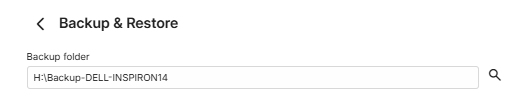
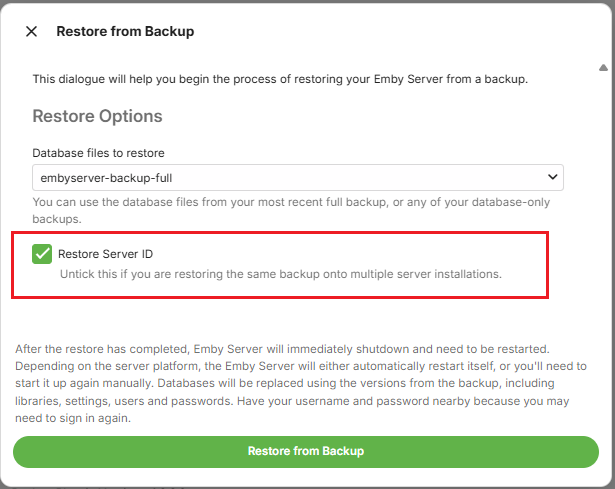
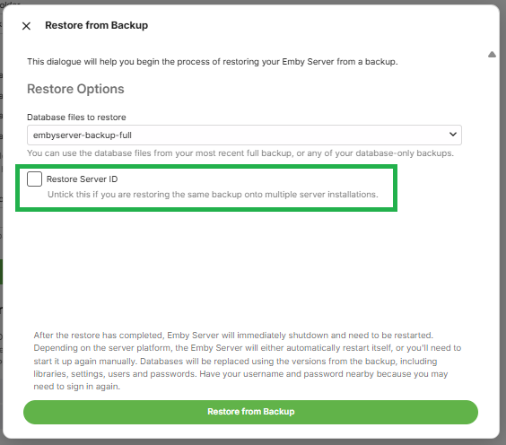

The steps detailed in this article assume you wish to have another server with the same or additional media to the existing emby server. If the same media is copied to the additional server, the libraries on the additional server may have a different set of top level root directories, but the actual media directories and files would be the same below the libraries top level folders. It is expected that you would be keeping the files paths syntax the same, i.e. Both being Windows machines or both being Linux/NAS/Mac/. Basically, the directory/file separator character of `\` for windows or `/` for the others need to be the same on both systems.

## Install Emby Server on the new system

Ensure that the version of the Emby Server you are installing on the new system is the same or later than the version on the current system. Note that backups from old pre version 4.8 of Emby Server are not compatible with the current versions of Emby Server.

When going through the initial install on the new server, you do not need to create any libraries.

Add your [Emby Premiere](Emby-Premiere.md) Key to the new Emby Server.

## Add the media to the new system

Have all the media available on the new computer / NAS. Library top level folders can be different but below that, all media needs to be exactly as was on the original machine.

The default directories for Camera-Uploads and Live TV Recordings should be copied onto the new system - within the equivalent data directory below the [Emby Server Data Folder](Server-Data-Folder.md) on the new system.

You can edit libraries later to remove what is not required for this additional server.

## Make sure permissions are correct for Emby Server to read / write to the media directories

Have all the media available on the new computer / NAS.

Ensure that the Emby Server process running on the new system, will have full permissions access to the media.

## Make the Emby Server backup available on the new system

You can copy the top level folder that was configured on the original system for the Backup & Restore plugin to the new system.

In the example for the configured backup [here](Backup-Using-Plugin.md), we had `H:\BACKUP-DELL-INSPIRON14` as the Emby Server backups parent folder.
Copy that directory contents to the new system, so we have it, for example, as `C:\Emby-Inspiron14-Backups`. The `embyserver-backup-full` directory will be directly below that.

## Configure the Backup & Restore Plugin on the new system

Open the Backup & Restore plugin by clicking on it in the Advanced section of the Emby Server dashboard on the new system.

Configure the backups path to be for the backups folder from the old server, so in the example mentioned above, we would change the new server "undefined" path to be `C:\Emby-Inspiron14-Backups`

New server initial backup path

and if the backups have been moved to `C:\Emby-Inspiron14-Backups` on the new server, set it to that:

Click "Save" after entering the path

## Restoring the old server's Last Full Backup

You will see on the page, the latest available backup.

If it does not show the latest backup, check that the path for the backup/restore is correct and the path is the parent folder for the "embyserver-backup-full" folder.

On the **Current Backup Info** screen, Click on **Restore from Backup**.

This will show the following screen:

You will have the latest full backup preselected: "**embyserver-backup-full"**.

As this is an additional server, make sure the "**Restore Server ID**" is **NOT** ticked.

 
If you are using [Emby Connect](Emby-Connect.md), re-link local accounts to Emby Connect after the restore. See [Emby Connect for Users](Emby-Connect-for-Users.md).

Click on **Restore from Backup**

You will be prompted to confirm. Click on **Restore from Backup** to confirm.

When the restore completes, Emby Server will automatically restart.

Make sure you close all previous browser sessions accessing the server and open a new browser session to access the restored emby server.

## Edit all libraries 

As this is an additional server, go through the libraries and configure them to what media you wish to have on this server, adding new folder paths / removing obsolete folder paths.

## Configuring the new server backups

After the restore, the backup configuration will be what the old server had. This, most likely, will not be correct for the new server.

Decide on where you want the backups to be stored and what options to have and save the changes.

After you set the configuration, test by running a server backup in **Task Scheduler**.

Open Backup & Restore and you should now see the Current Backup Information.

## Configuring Remote Access

The remote access settings for the public port will need to be changed as this will clash with the original server. You need to change the public ports used for http and https to be different from what you had on the existing server.

> [!IMPORTANT]
> Ensure you have a DHCP Reservation in the router for the IP Address of the additional server.
>

Refer to [Network Setup](Hosting-Settings.md) and change the public ports to be different from those used for the existing server.

Decide on whether to have a manual port forward in the router or automatic port forward created by Emby Server using uPnP.

## Scan Libraries

Once all the required media is in place and libraries configured, open the Server Settings **Library** page and click on "**Scan Library Files**"

