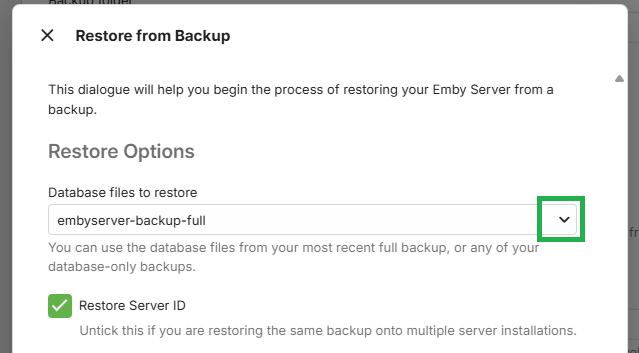
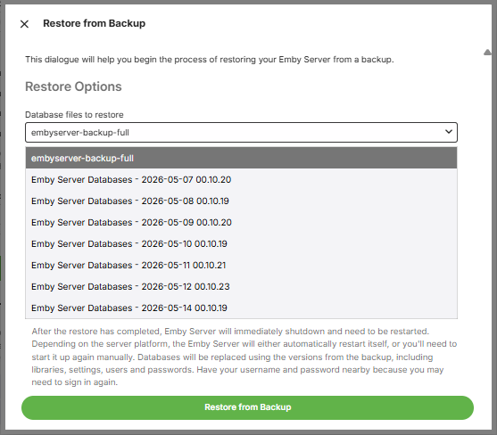

If you have [configured backups](Backup-Using-Plugin.md) to keep extra backups of the emby server databases, you can do a restore that would revert the databases to an earlier backup set. The restore will use the last full backup data but the databases will be from the backup date you select.

Launch the Backup & Restore plugin by clicking on Backup & Restore from the Advanced section of the server dashboard left sidebar.

This should show the current backup.

If it does not show the current backup, check that the path for the backup/restore is correct. If is is not set, there would not be a backup to restore from.

On the **Current Backup Info** screen, Click on **Restore from Backup**. 
 
This will show the following screen:

In **Restore Options** section, open the drop-down to see the list of all available database backup sets.

Select the backup for the day/time you wish to go back to.

As this restore is not for a new additional server, keep the **"Restore Server ID"** ticked.

> [!Note]
> Whilst the databases will be restored for the selected date/time, the other emby server data will be restored from the last backup.

Click on **"Restore from Backup"**

You will be prompted to confirm. Click on **Restore from Backup** to confirm.

When the restore completes, Emby Server will automatically restart.

Make sure you close all previous browser sessions accessing the server and open a new browser session to access the emby server.
