The steps detailed in this article cover migration to another system, allowing for libraries to have a different set of top level root directories, but the actual media directories and files would be the same below the libraries top level folders. It is expected that you would be migrating from one windows machine to another or from a system with Linux file path syntax to one that has the same similar syntax. Basically, the directory/file separator character of `\` for windows or `/` for the others needs to be maintained in the migration.

The Backup and Restore plugin will be used for this.

In the example covered below, the media tree looks like this:

**Media Tree Folders (original)**
```
H:\EMBY-MEDIA
├───Movies1
│   ├───The Black Island (1992) - The Adventures of Tintin
│   └───The Broken Ear (1992) - The Adventures of Tintin
├───Movies2
│   ├───All the President's Men (1976)
│   └───Jack Reacher - Never Go Back (2016)
├───Music
│   ├───Alanis Morissette
│   │   ├───Alanis Morissette - Feast on Scraps
│   │   └───Alanis Morissette - So-Called Chaos
│   └───Carly Simon
│       └───Carly Simon - The Very Best Of
├───Photos
├───TV
│   ├───Fawlty Towers
│   │   ├───interviews
│   │   └───Season 1
│   └───The Traitors (UK)
│       └───Season 1
└───Videos
```

**Media Tree Folders (replacement server)**
```
C:\MEDIA
├───Movies1
│   ├───The Black Island (1992) - The Adventures of Tintin
│   └───The Broken Ear (1992) - The Adventures of Tintin
├───Movies2
│   ├───All the President's Men (1976)
│   └───Jack Reacher - Never Go Back (2016)
├───Music
│   ├───Alanis Morissette
│   │   ├───Alanis Morissette - Feast on Scraps
│   │   └───Alanis Morissette - So-Called Chaos
│   └───Carly Simon
│       └───Carly Simon - The Very Best Of
├───Photos
├───TV
│   ├───Fawlty Towers
│   │   ├───interviews
│   │   └───Season 1
│   └───The Traitors (UK)
│       └───Season 1
└───Videos
```

In this example, the **Movies** library has two library root folders defined **Movies1** and **Movies2**. The server has a child user account that has no access to the TV Library and the Photos library. The child account has folder level access restrictions for the **Movies** library with only **Movies1** allowed.

The steps assume that:
- You are doing the restore whilst accessing the new server locally and not through a remote access connection, and
- all metadata options will be selected in the backup used for the migration, and
- that you would be copying or restoring from your own backups, all the media to the new system, and
- any media held within the programdata area for Emby Server, e.g. camera uploads, LiveTV recording default library would be backed up by you and restored into the equivalent program data paths on the new system,
- you will be maintaining the same sub-directory structure and filenames below the libraries top level folders, and
- you will be migrating from a Windows PC to another Windows PC, or from any Linux/NAS/Mac machine to another, and
- where library root folders change and you have folder level access restrictions, you will go through the user accounts and re-apply the restrictions for the new server libraries folder paths. 
 

## Backup your media

You are responsible for ensuring your media is backed up and is available to copy to the new system. Any artwork/nfo files stored alongside the media files, should be included in your migration of the media to the new system.


## Backup you camera-uploads and Live TV recordings

Where these are stored in the default Emby Server directories, they will need to be backed up and restored by you or simply copied across to the new system. These would be within the data folder below the Emby Server Program Data area. See [Emby Server Data Folder](Server-Data-Folder.md) for information on where the Emby Server Data area is on various platforms. The directories would be and these would need to be in a similar folder tree on the new system below the Emby Server Program Data base.

```
    data\livetv\recordings
    data\camerauploads
```

## Configure Backup on the current server to include all metadata

See [Backing Up Emby Server](Backup-Using-Plugin.md) for configuring the backups. It is recommended that you select have all the metadata backup options selected when creating a backup for migration to a new system.

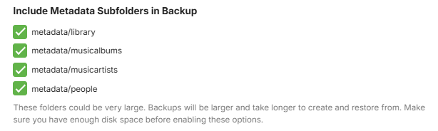

When selecting all backup metadata options, the initial backup may take a long time but subsequent backups should be fast.

When you have a full backup available, you can now proceed to setup the new server.


## Install Emby Server on the new system

Ensure that the version of the Emby Server you are installing on the new system is the same or later than the version on the current system. Note that backups from old pre version 4.8 of Emby Server are not compatible with the current versions of Emby Server.

When going through the initial install on the new server, you do not need to create any libraries.

Add your [Emby Premiere](Emby-Premiere.md) Key to the new Emby Server.


## Add the media to the new system

Have all the media available on the new computer / NAS. Library top level folders can be different but below that, all media needs to be exactly as was on the original machine.

The default directories for Camera-Uploads and Live TV Recordings should be copied onto the new system - within the equivalent data directory below the [Emby Server Data Folder](Server-Data-Folder.md) on the new system.


## Make sure permissions are correct for Emby Server to read / write to the media directories

Have all the media available on the new computer / NAS. 

Ensure that the Emby Server process running on the new system, will have full permissions access to the media.


## Make the Emby Server backup available on the new system

You can copy the top level folder that was configured on the original system for the Backup & Restore plugin to the new system.

In the example for the configured backup [here](Backup-Using-Plugin.md), we had `H:\BACKUP-DELL-INSPIRON14` as the Emby Server backups parent folder. 
Copy that directory contents to the new system, so we have it, for example, as `C:\Emby-Inspiron14-Backups`. The `embyserver-backup-full` directory will be directly below that.


## Configure the Backup & Restore Plugin on the new system

Open the Backup & Restore plugin by clicking on it in the Advanced section of the Emby Server dashboard on the new system.

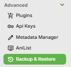

Configure the backups path to be for the backups folder from the old server, so in the example mentioned above, we would change the new server "undefined" path to be `C:\Emby-Inspiron14-Backups`

New server initial backup path

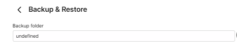

and if the backups have been moved to `C:\Emby-Inspiron14-Backups` on the new server, set it to that:

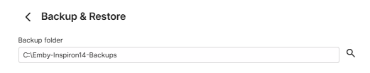

Click "Save" after entering the path


## Restoring the old server's Last Full Backup

> [!IMPORTANT]
> Ensure you do the restore whilst accessing the server locally on the local network as remote access may need re-configuring after the restore.

After configuring the Backup & Restore backup path, you will see on the page, the latest available backup.

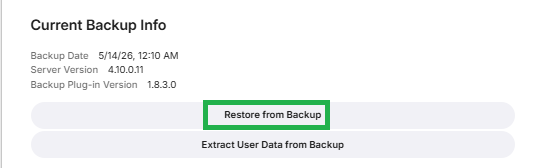

If it does not show the latest backup of the old server, check that the path for the backup/restore is correct and the path is the parent folder for the "embyserver-backup-full" folder.

To start the restore process. on the **Current Backup Info** screen, Click on **Restore from Backup**.

This will show the following screen:


You will have the latest full backup preselected: "**embyserver-backup-full"**. 

Ensure the "**Restore Server ID**" is ticked.

> [!IMPORTANT]
> Make sure that the original server is shutdown and would not be launched again whilst this new server is running.


Click on **Restore from Backup**

You will be prompted to confirm. Click on **Restore from Backup** to confirm.


When the restore completes, Emby Server will automatically restart.


Make sure you close all previous browser sessions accessing the server and open a new browser session to access the restored emby server.


## Edit all libraries on the new system to add the libraries new root folders as media paths

In this restore example, all the libraries media root folders that were below `H:\Emby-Media` on the old server are now held below `C:\Media` on the new server and there is no "H:" drive on the new server.

Open the restored Emby Server Settings and select Library in the dashbaord sidebar

In this example, we have 5 libraries and they will all still have the old paths for the original server

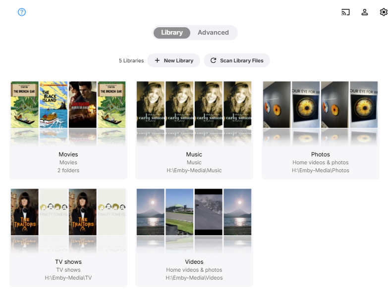

For each library, click on the `...` and then click on `Edit`

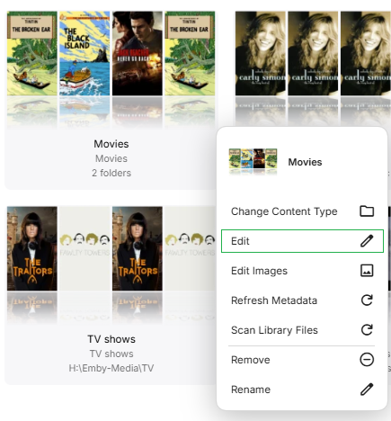

For the Movies library, in this example, we will add, one at a time, `C:\Media\Movies1` and `C:\Media\Movies2` folder paths to the existing old server paths `H:\Emby-Media\Movies1` and `H:\Emby-Media\Movies2`.

Click on Folders **+Add**:

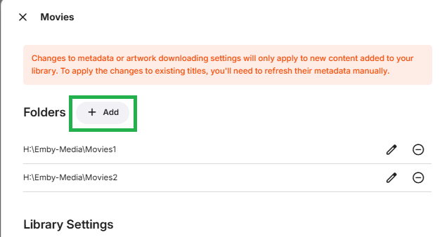

Enter the new folder paths for the Movies library. Do this for all the root folders that are specified, adding the new paths to supplement the old server paths.

We now have both paths specified for the server, old server folder paths and the new server folder paths.

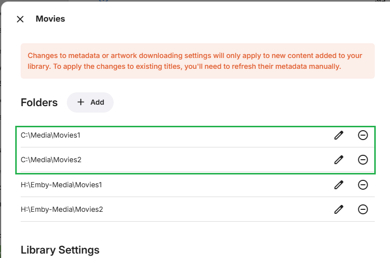

Repeat this action for all root media folders and for all libraries.

Ensure you also cover the special case of default CameraUploads and Live TV recordings libraries paths if they were in use and within [Emby Server Data Folder](Server-Data-Folder.md) area.


## Adjust any users Folder Level Access settings

If you have Library Folder Level access restrictions for users, these will need to re-configured for the new folder paths. Whole Library access restrictions will carry forward without need for any adjustments, but folder level restrictions will need to be re-instated for the libraries new folder paths.

In this example, we have one user account which had no access to the TV and Photos library and a folder level access restriction for the Movies library:

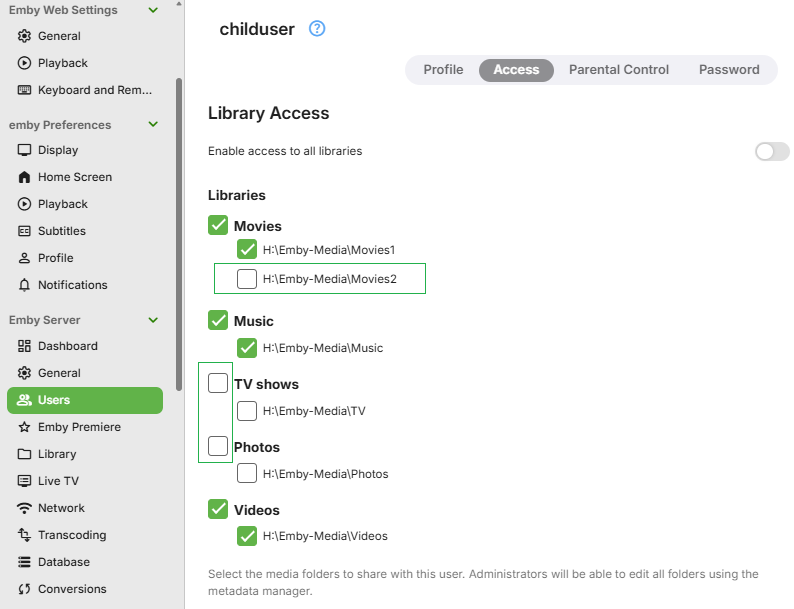

On the new server, the access levels for this user account shows now as follows:

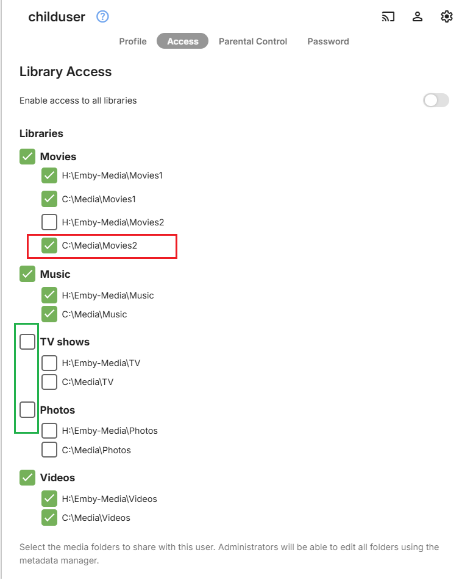

You can see the TV and Photos library have maintained the restriction, because it was at the library level. For the Movies library, the new folder for Movies2 shows as accessible. This needs to be amended to remove the folder access and save the changes.

We need to untick `C:\Media\Movies2` for this user and then click **Save**


Check all users Folder Level Access, where you have chosen to have restrictions as folder level.  


## Edit all libraries on the new system to remove the libraries old server root folders

Having added all the new paths, we can now remove the old H: Drive path.

Edit each library as above, and for the old folder paths, click on the remove icon

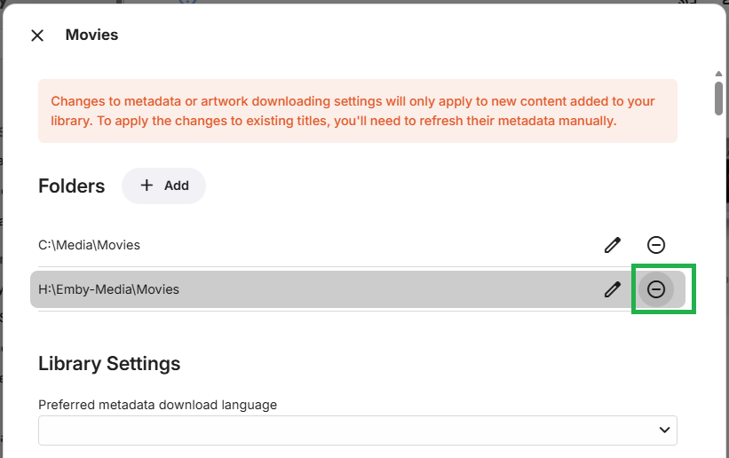

You will then be asked to confirm the removal of this folder path.


Click on **Remove**

Repeat this for all old folder paths for all libraries.

All libraries will now show just the new paths.

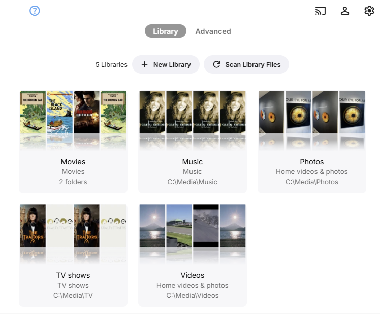


## Check the new restored server

Go to the restored server Home Screen and check out the libraries. 

In this restore example, the Movies library images are in place 

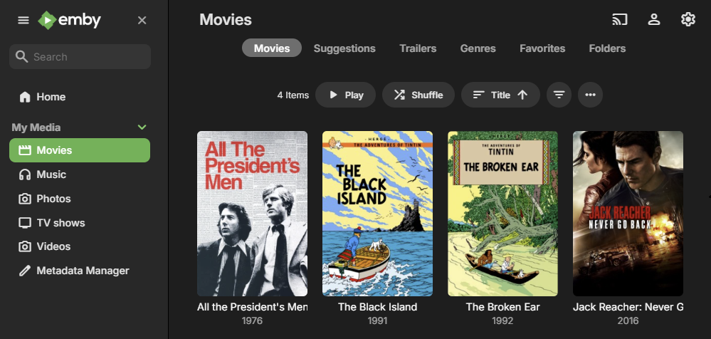

and picking a TV show from the TV library, posters and actors all in place.

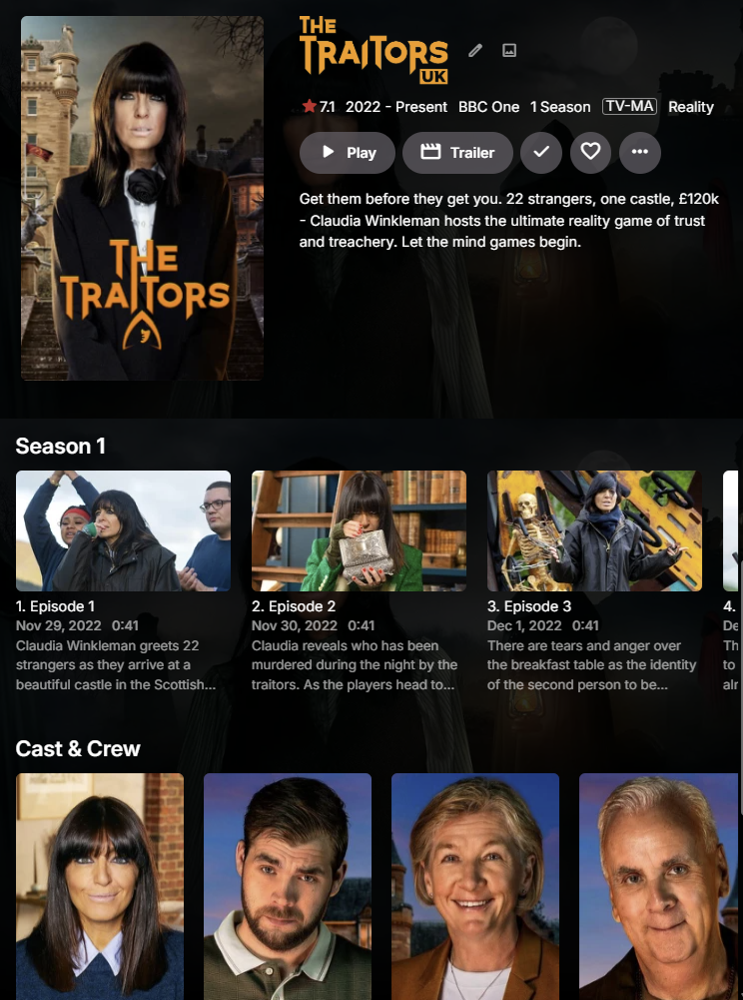

Switching user to the **childuser** account, the Movies library view 

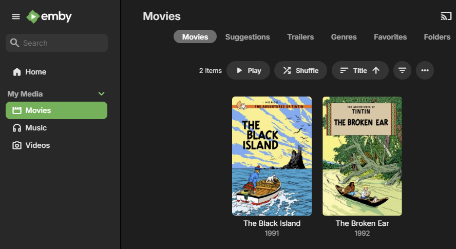

The TV and Photos libraries do not show as expected and only the movies within Movies1 folder show.


## Configuring the new server backups

After the restore, the backup configuration will be what the old server had. This, most likely, will not be correct for the new server.

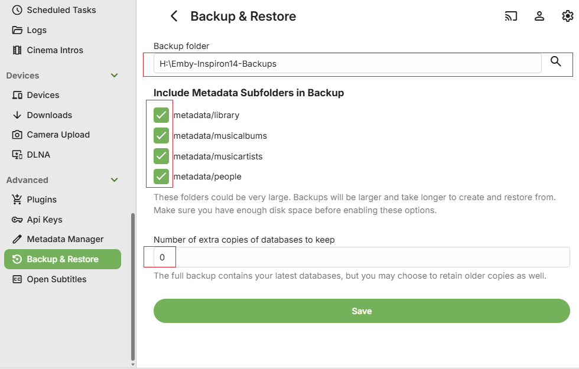

Decide on where you want the backups to be stored and what options to have and save the changes.

After you set the configuration, test by running a server backup in **Task Scheduler**.

Open Backup & Restore and you should now see the Current Backup Information.


## Configuring Remote Access

If you are using manually created Port Forwards in the router, you will need to edit them to point them to the IP Address of the new server.

> [!IMPORTANT]
> Ensure you have a DHCP Reservation in the router for the IP Address of the new server.
> 

If you are using automatic uPnP Port Mapping, then you will most likely need to change the public port, because there would be a port forward for the old server and there is a 7 day expiry period before that public port can be switched to another IP Address.

Refer to [Network Setup](Hosting-Settings.md).

After the restore, the backup configuration will be what the old server had. This, most likely, will not be correct for the new server.


## Scan Libraries

Once all the required media is in place and libraries configured, open the Server Settings **Library** page and click on "**Scan Library Files**"

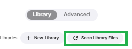


> [!Note]
> It is advisable that you do defer installing the additional plugins until you confirm that the restored server is functioning with no new issues after the restore.

 With the Emby Server operational and all media accessible, you can now install any Plugins that you had added to the server that is being restored. The configuration files for the plugins are automatically restored, so once the plugins are added and the server restarted to complete the plugins installation, the plugin configuration files should get picked up.

> [!Note]
> Be aware that some plugins may have additional data eg a database that would need to be copied over manually or an application that may need to be installed. Please carefully check the requirements for each plugin.

If you have Live TV configured, go to server settings / Live TV and perform a "Refresh Guide Data"
