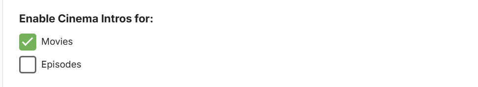
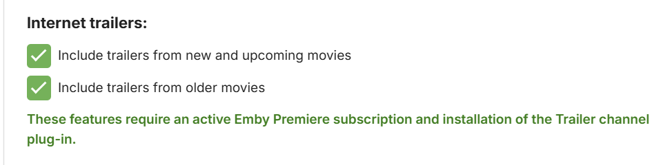
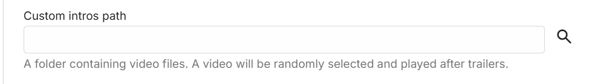
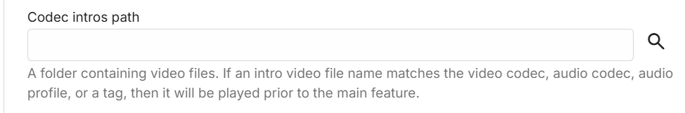
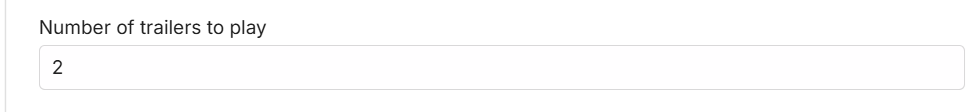
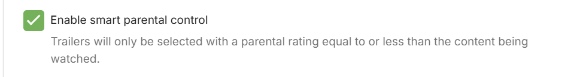
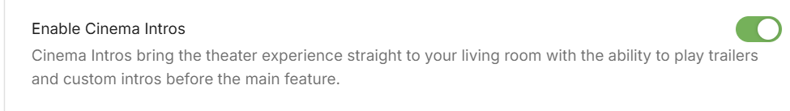

Cinema Intros brings the theater experience straight to your living room with the ability to play trailers and custom intros before the main feature.

Cinema Intros is configured in the server dashboard by navigating to the Cinema Intros menu. By default it is disabled.

## Choosing when to enable Cinema Intros

The configuration page allows you to choose the types of videos that will trigger cinema intros. Currently, Movies and Episodes are supported. A video is determined to be a Movie or Episode based upon the content type chosen when setting up the library.

## Internet Trailers

A vast library of internet trailers are available for use with cinema intros. The categories available are for new movies and movies coming soon to theaters, with option to include trailers for older movies.

This feature has two requirements:

* An [active Emby Premiere subscription](http://emby.media/donate)
* Installation of the [Trailer plugin](Plugins.md), either before or after enabling cinema intros.

## Local Trailers

If your movie folders contain local trailers, enabling this option will allow these trailers to be used within cinema intros. See [trailers](Trailers.md) for more information.

## Custom Intros

In addition you can specify your own custom videos to be used with cinema intros. Simply create a folder containing the videos, and enter the path in the custom intro field:

**Important**: Make sure to run a library scan after adding new intro files.

## Codec Intros

Codec intros allow you to create intros based on the media information of the main feature you are watching. For example, if you're watching a movie with AC3 audio, you can create an ac3 intro called ac3.mp4, and place this in your codec intro path.

The following fields are used to determine a match:

* Video Codec
* Audio Codec
* Audio Profile
* Tags

Here are some examples: (extension doesn't matter)

* A movie has h264 video, intro file is named "h264.mp4"
* A movie has ac3 audio, intro file is named "ac3.mkv"
* A movie has eac3 audio, intro file is named eac3.mp4
* A movie has DTS-HD MA audio profile, intro file is named "dts-hd ma.avi"
* You've added a tag to a movie called "waffle", intro file is named "waffle.mpg".

> [!TIP]
> The file name (before extension) should be the same name as the codec shown when looking at a video for either audio codec or video codec. To review the media information for one of your videos, visit the detail screen in the web app.

Simply create a folder containing the videos, and enter the path in the codec intro field:

> [!Important]
> Make sure to run a library scan after adding new intro files.

> [!TIP]
> With the use of Custom Intro directories you can make use of Tags for each movie/episode such as "HomeMovies".  These tags can be added using the MetaData Manager.  
Make sure that Intros added to the custom directories above have proper tags in the files before adding them to Emby.  You can use Windows or other tag editor to assist with this. This allows Emby to display your custom Intro for any movie tagged with the same name.

## Number of Trailers played

The initial default is set to 2. This can be modified in this setting:

## Trailers and Watched status

The unwatched setting will prevent trailers that you've already seen from being used again, as well as trailers from movies that you've already seen. Note that enabling this setting may eventually result in no unwatched trailers being available.

## Parental Control

Smart parental control will compare the ratings of trailers against the rating of the movie being played, and filter the trailers based on ratings of an equal or lower value. For example, you might be an adult watching The Goonies with your children. The Goonies is rated PG, so this setting will exclude any trailers with a higher rating than PG. Unrated trailers will also be excluded.

## Emby Apps Control

Emby Apps have settings to enable or disable Cinema Intros. TV apps enable Cinema Intros by default.

Click the user icon in the top right hand corner of the app screen and then select **App Settings**-> **Playback** and scroll down to see the **Cinema Intros** option.

