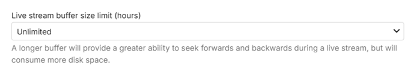
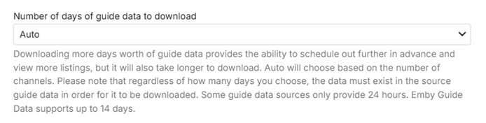
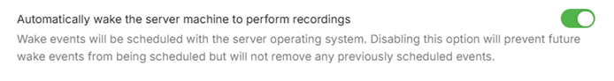
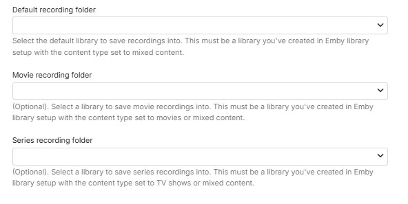
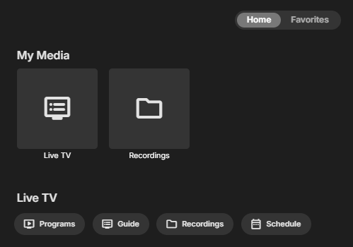
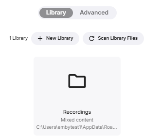
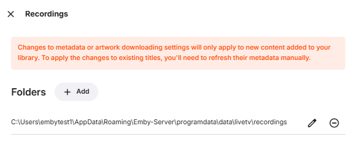
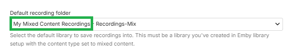
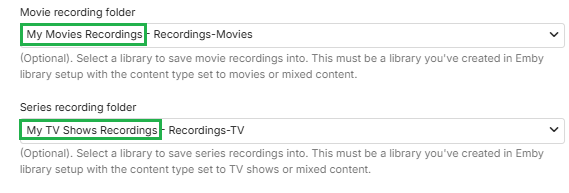
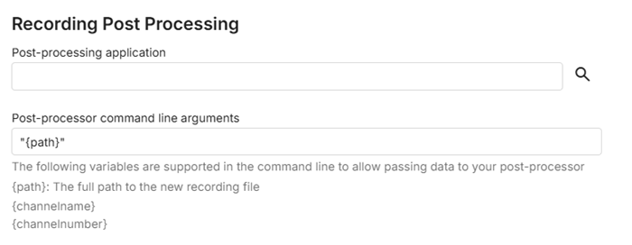

To set the optional Advanced settings, click **Advanced** in the administrator dashboard under the Live TV Menu.

## Live Stream Buffer

You will have an option to limit the Live Stream buffer. 

## Guide Data Days

Also you can specify the amount of Guide Data that is loaded.  You can manually set this from 1 to 14 days or leave it set to Auto. When you leave it set to Auto, Emby will choose the amount of days loaded based on how many channels you have defined to balance performance with the convenience of having as much guide data as possible.

## Waking from Sleep for Scheduled Recordings

There is an option for waking the server machine to perform scheduled recordings.

## Start / End recordings padding

You can set custom start and end times to pad your recordings.  These are blank by default but in this example below, both were set to 5 minutes.

With the above settings in place all recordings schedule will have a default start time of 5 minutes before the scheduled time and will end 5 minutes after the scheduled end time.

When individual events are schedule to record by a user in any Emby Application these settings will be the default used.  This can be overrode for each individual recording if needed.  For example people recording sporting events will often change the end time to 30 or 60 minutes to make any overtime play is taken into consideration.

## Default Recordings Library Paths

The next three options allow you to set the default recording library and folder path used within the existing libraries. It also allows you to set a specific library parent folder within the selected library. These library-folder paths will be used for recordings of all Movies and all TV Shows.

These 3 options are blank by default:

The following describes the default behavior when these paths are not set.

All recordings would go into an automatically created **Mixed Content** type library, named **Recordings** with the actual recordings going into folders within the **data\livetv\recordings** directory which is within the [Emby Server Data Folder](Server-Data-Folder.md).

appearing as follows in the Settings / Library view

and you can see the path when you open the server settings for the library:

You can change the default folder for all recordings by first creating a **Mixed Content** library type as explained in [Library Setup](Library-Setup.md) and then amend the Live TV Advanced setting for the **Default recording folder** . In the example below, a library was created named "My Mixed Content Recordings" and its library root folder path had a target subfolder named **"Recordings-Mix"**. This is shown on this screen as "**Library Name - Target sub-folder-name**"

In the following example, instead of changing the Mixed Content default recording library, we have two separate libraries for recording movies and recording TV series. The libraries must be created first, with the correct content type for each, as outlined in [Library Setup](Library-Setup.md).

> [!Note]
> If you are changing the defaults for recording libraries, make sure you have full read/write permissions for Emby Server.
> 

## Automatic Post Processing of recordings

These next two sections are advanced functionality that won’t be covered here. This is for people who create scripts or programs that manipulate recordings after they finish.  This post processing can be used for many different things including commercial cutting, converting files to specific formats, moving files to other parts of the system.

You can find samples of scripts in the Emby forums shared by users and get help setting these up as well.

## Saving the changes

If you’ve made any changes on the **Advanced** Settings page, click the **Save** button to finish.

