Emby has native support for current [Hauppauge](https://hauppauge.com/) PCIe and USB Tuners on Windows.

You will need first to install the Hauppauge WinTV app and go through the configuration process and ensuring latest drivers and channel data is in place. The product also needs to be activated. The earliest supported version is v8.5. The following is the link for the [WinTV v10 app](https://www.hauppauge.com/pages/support/support_wintv10.html).

When installing the WinTV application, make sure that it is installed for all Windows users to access and that the folder paths for the installation and recordings are in directories that have full permissions set for the windows user account that Emby Server would run under. The following shows the paths that need to be defined at install time.

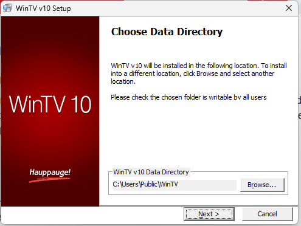

and

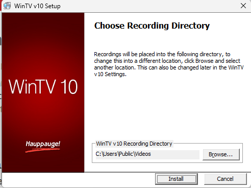

These paths can also be set through WinTV application settings.

After installing the Hauppauge WinTV app, ensure all the channel tuning data is updated, click on **Settings** and then **Check for Tuning Updates** in the **General** tab.

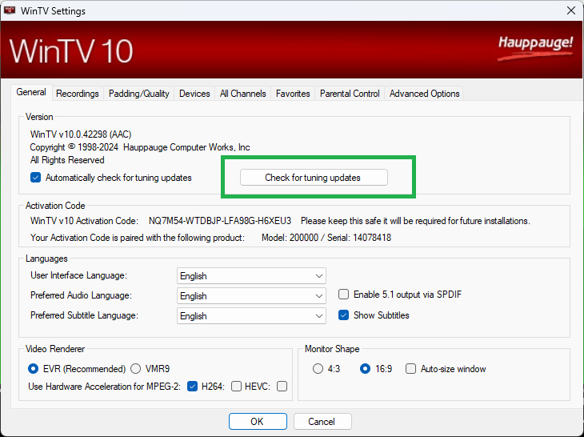

After ensuring that the tuning data is up to date, make sure the Hauppauge Pause Buffer path is setup and permissions are set for the Emby Server windows process for full access. To set the directory paths, on WinTV v10, select the **Recordings** tab and on WinTV v8.5, select the **Capture** tab. The Disk Buffering Pause-Mode Recording Directory is used by Emby Server for Live TV streaming and recordings.

**WinTV v10**

**WinTV v8.5**

Next is to configure the tuner and scan for the TV channels. The example in the following screenshots is for DVB-T OTA channels for the UK.

Select the tuner and click on **Tuner Setup**.

Go through the options applicable to your region, type of tuner and channels available for you.

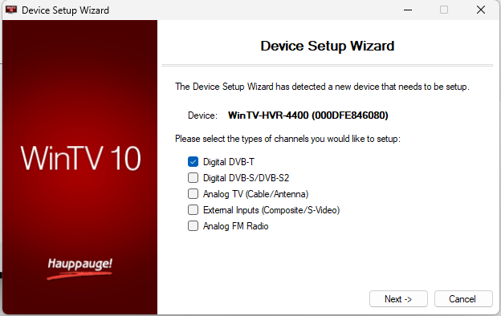

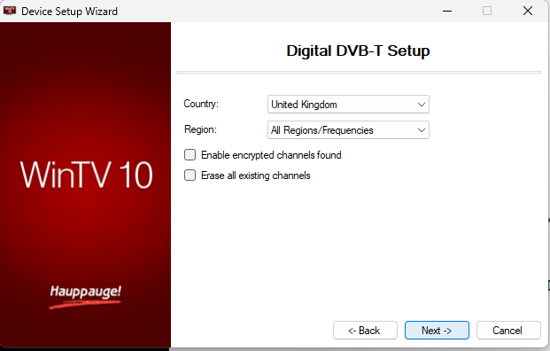

On completion of the scan and setup, use the WinTV app to test that the channels do stream and the signal and quality is good. 

Close the WinTV application and prepare to add the Hauppauge tuner to the Emby Server.

The Live TV & DVR feature requires a valid [Emby Premiere](Emby-Premiere.md) subscription. This would be indicated on the setup screen when there is no subscription:

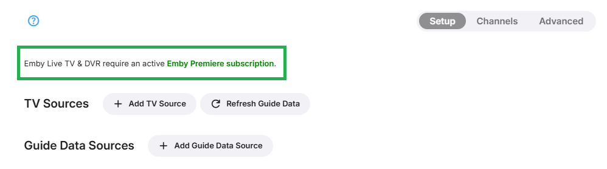

> [!NOTE]
> Whilst you will be permitted to add the Live TV device, there would be no channels or guide data without an [Emby Premiere](Emby-Premiere.md) subscription.

To add an Hauppauge device, click on **+ Add TV Source** and select **Hauppauge**

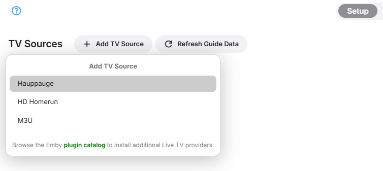

This will show the following

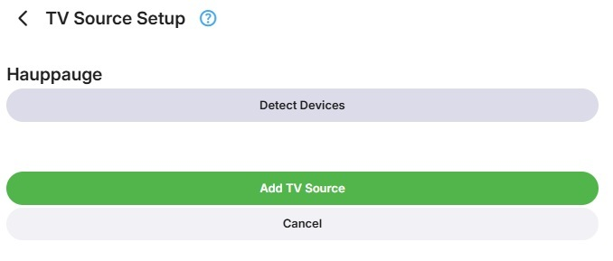

Click on **Detect Devices**

You will then see all the detected new Live TV tuner devices, select the Hauppauge device you wish to add

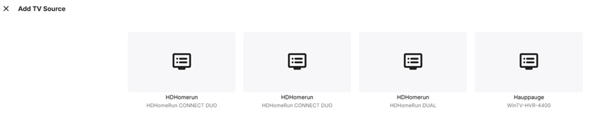

You will be back to this screeen. Click on **Add TV Source**

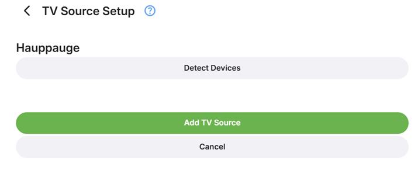

You will now see the device added.

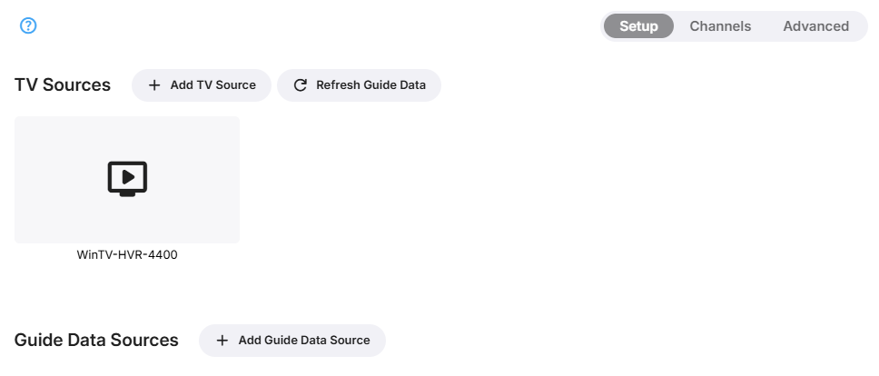

You are ready now to add guide data and where needed, map tuner channels to guide data and optionally configure the advanced Live TV settings. See the relavant paragraphs on the [Live-TV](Live-TV.md) document.
