One of the areas in which Emby Server shines as a media server is the metadata management. The server has a metadata manager which allows you to view all of the metadata for every item in your library in one place.

The metadata manager can be accessed via the side-bar in the web client and other emby client apps.

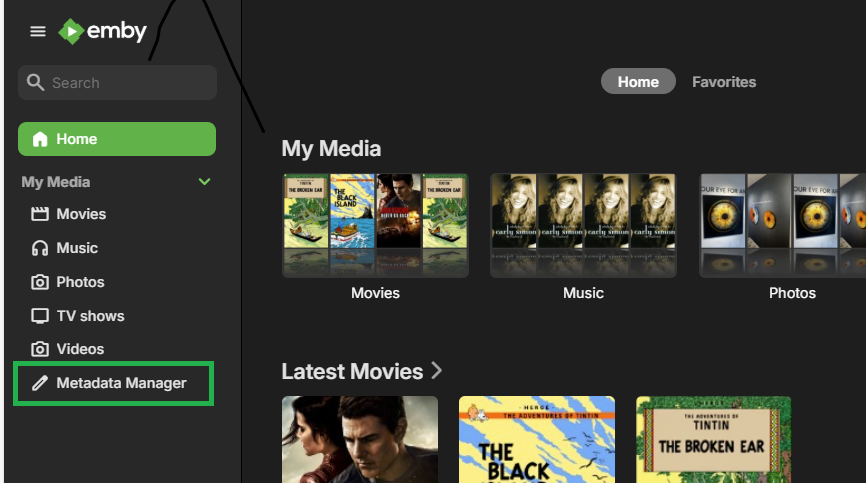

The functionality is also available via the **"..."** options button and selecting one of the edit options for any media item:

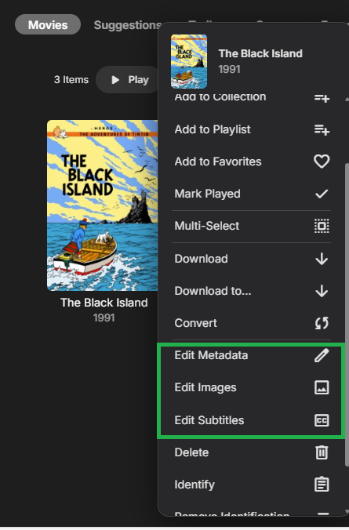

## Using the Metadata Manager

#### Refreshing metadata

Each media item has the option to **Refresh Metadata**. The option is available at every level, eg episode, season, series, movie, library etc.

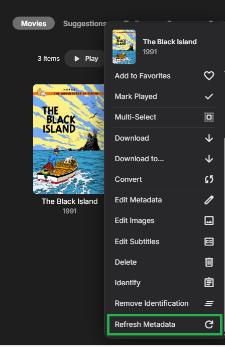

This will open the **Refresh Metadata** options screen

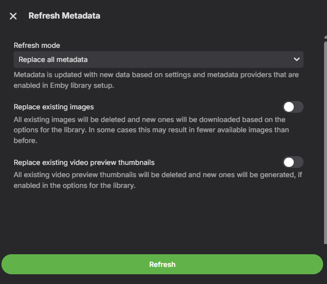

Selecting **Refresh** will pull fresh metadata from each of the databases that the server is configured to pull from for the library. In addition, it will download any images that may be missing (logos, disc images, posters, etc.).

There are 2 **Refresh modes**:

- Refreshing all metadata (the default option) will overwrite all of the fields with metadata from outside databases.
- Refreshing only missing data will preserve all of the existing metadata and only populate the fields that are missing metadata.

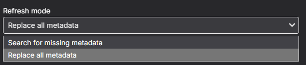

Selecting **Replace existing images** will force the server to remove existing images and re-download all of the images for the media item.

> [!WARNING]
> This option would also remove your custom images. Make sure you save these if you need to bring them back later.

#### Identifying items

All media can get their information from online databases such as TheMovieDB and TheTVDB. If an item is misidentified by the server, you can manually identify the item using the **Identify** button, or, if you already know the database IDs for your incorrectly identified item, simply insert the correct IDs into the database fields and refresh the item.

#### Database IDs

Database IDs are extremely important to the server to determine what each media item is and whether it has been watched.

One catch to this approach is that media items with the same IDs (for example, a movie that has both a 3D and 2D version) will be treated by the server as the exact same item regardless of the existence of two separate files. This can mean that it can show up in the Resume tab or other places twice. Also, if you watch the 3D version but not the 2D version, the server will mark both formats as watched.

#### Saving metadata

Be sure to hit **Save** after changing ANY metadata; otherwise, all of your changes will be lost when you navigate away from the page. If you wish for the changes that you made to be persistent through a refresh of the item, you will need to either lock the metadata field you changed, or lock the entire item. Examples of the lock option can be seen here:

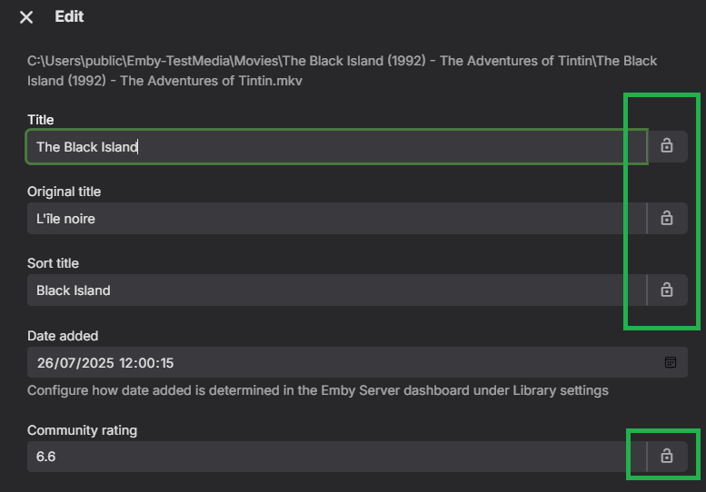

This shows how to lock the item:

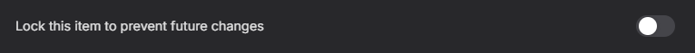

## Parental Controls and Metadata

You should be aware that there are certain metadata fields that affect the use of parental controls.

One good example of such a metadata field is the parental rating. The parental rating can be used to set whether a server user can access content that is above a certain rating, e.g. allowing a teen to access content rated PG-13 or below while restricting access to content rated at R or above.

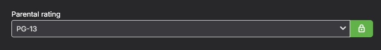

Another metadata item that you can use to prevent a user from accessing certain content is the **Tags** metadata field.

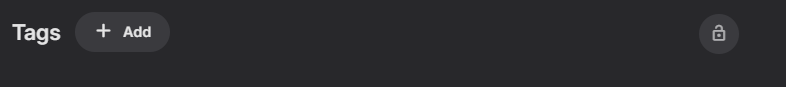

To keep a user profile from accessing certain content

- Tag each item that you want to prevent access to with a unique tag.
- Go to the **Users**->**Parental Control** in the server dashboard.
- Add the unique tag to the **Block content with these tags** field.
- Save the changes to the user profile and media tags.

You can also do the inverse and only allow access to content with specific tags. Add the tag to the **Allow only items with these tags** field.
 
To make sure the tags don't disappear in a library refresh, lock the **Tags** field in the item's metadata.

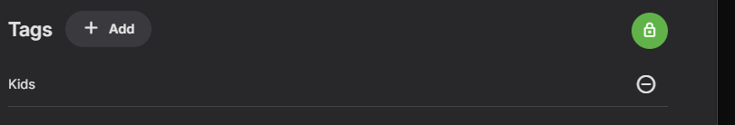

> [!TIP]
> Tags can also be used for custom Cinema Intro trailers. Simply add a tag to each movie/episode such as "HomeMovies".  Then you configure a path in Custom Intros for a Custom Codecs directory and add a movie with a tag (done externally) of "HomeMovies".  This allows Emby to display your custom Intro for any movie tagged with the same name.

## Subtitles

For your movies and TV shows, the metadata manager can ve used to manage subtitles. You can also access this for specific media items through the **Options** button and selecting "**Edit Subtitles**".

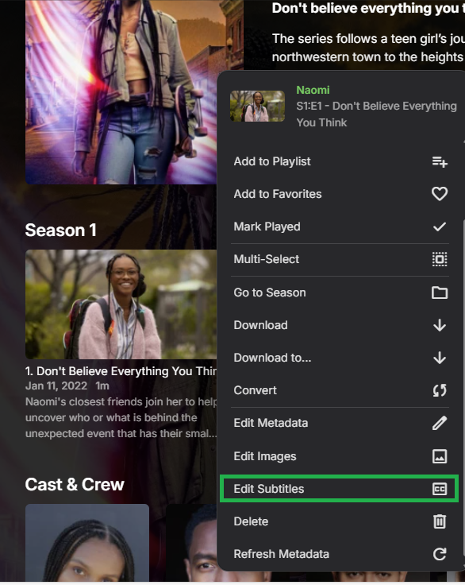

This will allow you to see which subtitles you have, whether they are graphical or text, and what languages the subtitles are in.

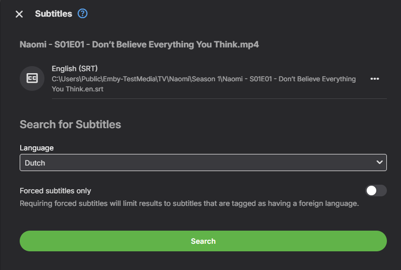

To search for new subtitles, you need to enable access to the Open Subtitles database, you will need to enter your account information on the Open Subtitles setup screen by selecting "Open Subtitles" within the "Advanced" menu in Server Settings:

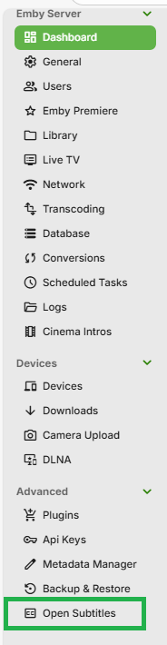

Clicking on "Open Subtitles" will load the page for entering your Open Subtitles account details

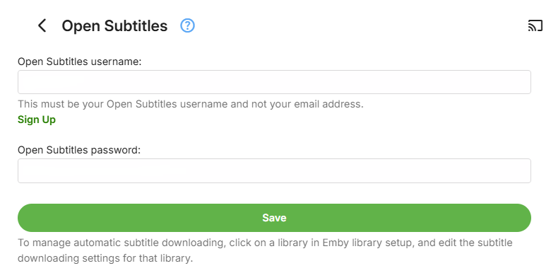

Refer to [Configure Open Subtitle plugin](Open-Subtitles.md#configure-open-subtitle-plugin).

With Open Subtitles configured, you can search for new subtitles. This is an example of search results:

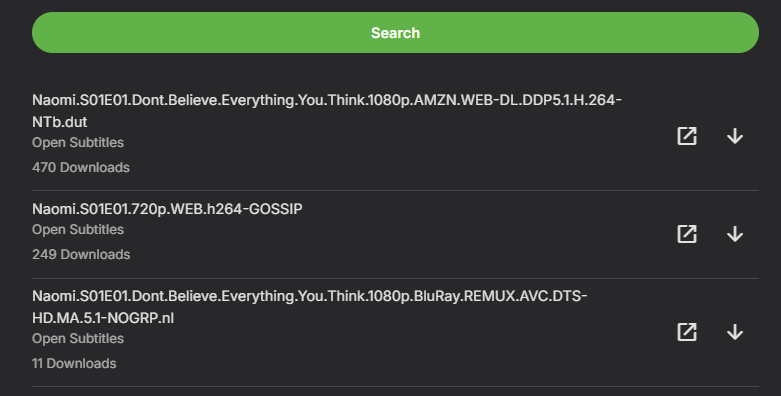

In Server Settings **Scheduled Task**s, the **Download subtitles** task will automatically attempt to downloaded missing subtitles.

## Images

Emby Server can automatically download images to improve the presentation of media in each client. Library settings have options for download of images. The following shows the options available for Movies and TV Shows libraries:

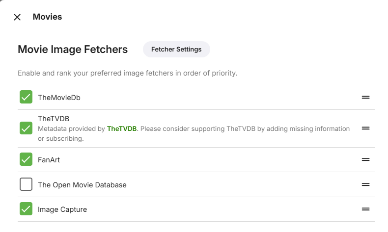

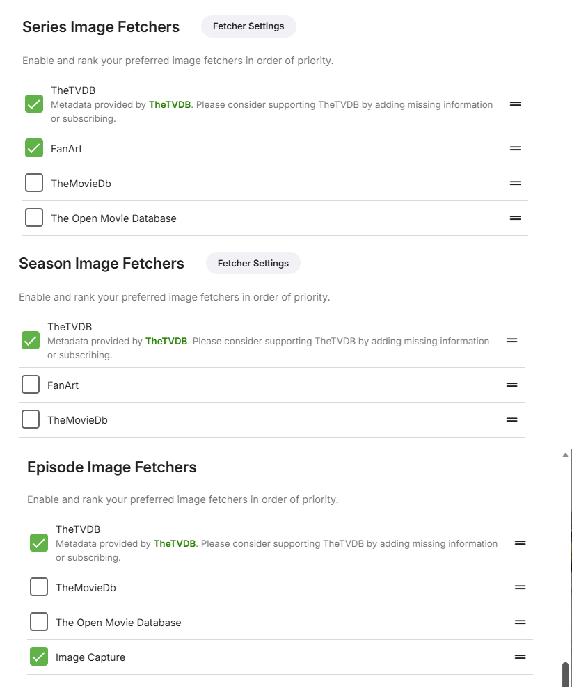

Images are downloaded from Fanart.tv, TheMovieDB, The Open Movie Database, and TheTVDB. 

For each item, you have an option to Edit Images that the emby server presents for your Emby Server clients.

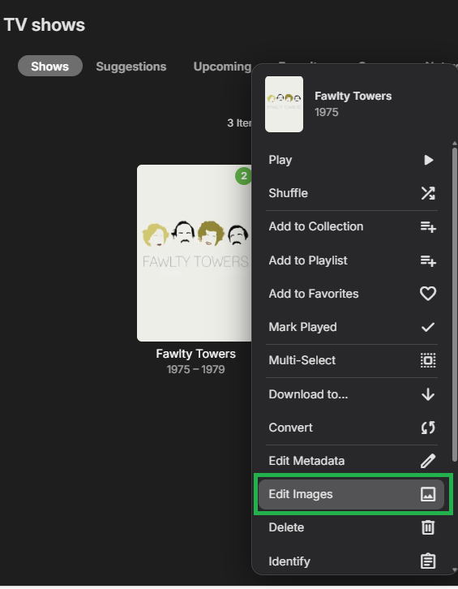

To change the image used, you can select the "..." options button 

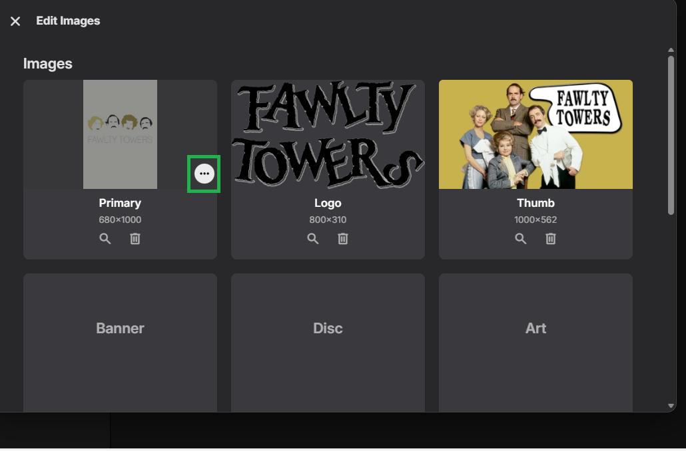

This will bring up a number of options, allowing you to edit the reference to the image through add or delete or specify a url, in addition to the search option:

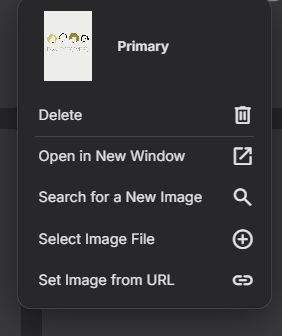

Alternatively, you can go directly to searching the databases for new images by clicking on the search button:

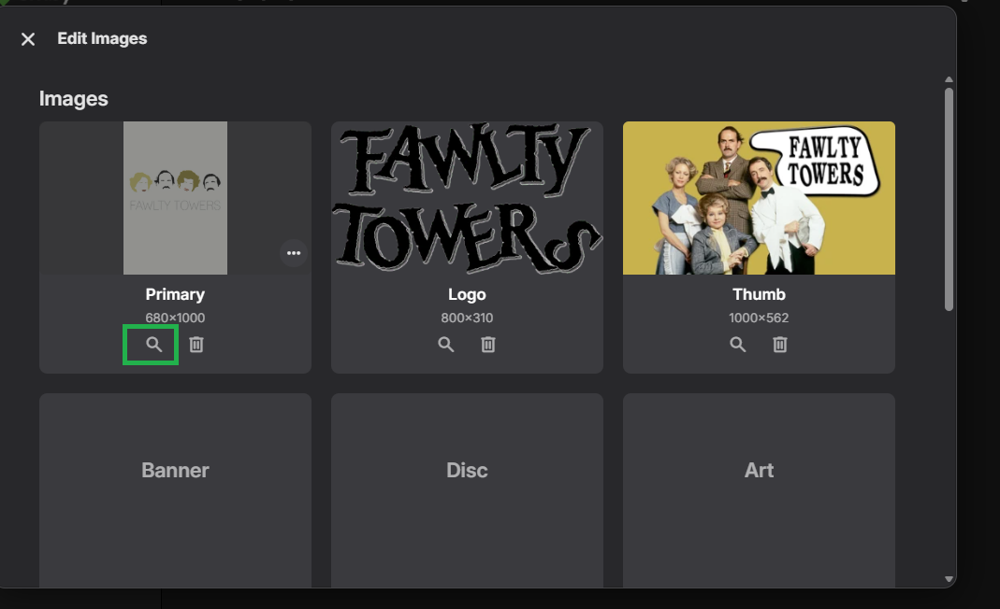

You will then be presented with the search results:

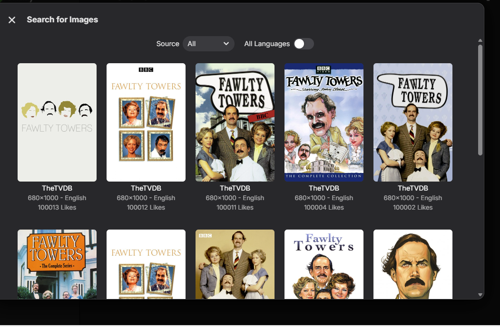

