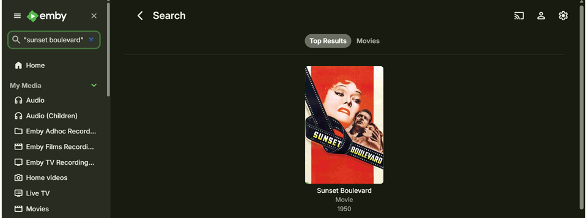
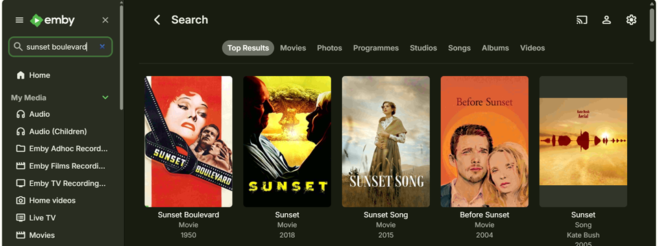
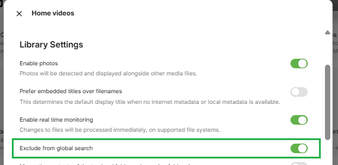

The Search feature allows you to search all libraries, Live TV sources and channels using a search pattern. The search would be for any metadata. A minimum of two search characters is required to start a search.  

## Search Patterns

Search patterns are not case sensitive and words / character sequences can be in any order

* Search for any of the specified words:

    `word1 word2 word3` 

* Search for all the specified words

    `"word1 word2 word3"`

* Search for character sequence(s) / partial word(s). This will be similar to the above two but with partial words.

**Examples**

Search for the **Sunset Boulevard** movie

The search can be entered as "Sunset Boulevard" or "Boulevard Sunset". This would pick search results where both words: sunset and boulevard are present.

If the quotes are omitted, the search would pick items where either sunset or boulevard is present.

## Exclusions from the Global Search

Libraries may be excluded from the global search by selecting that option in the settings for the specific library.

> [!Note]
> This exclusion is only for global searches and does not apply to specific library searches that are available on some Emby client apps.

## Specific Library search

Some Emby Apps, specifically **Emby for FireTV**, **Emby for Android TV** and **Emby for Roku**, offer either a global search when the search is initiated from the Emby Home Screen or a search limited to a specific library when initiated when viewing a library.

