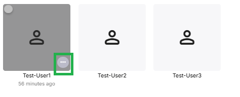
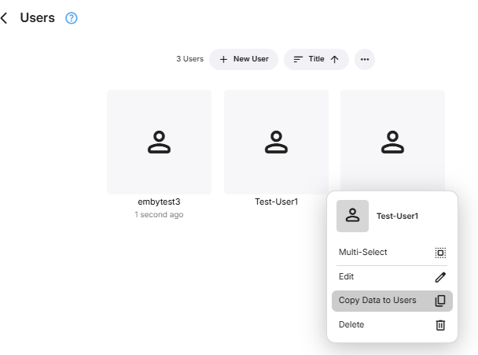
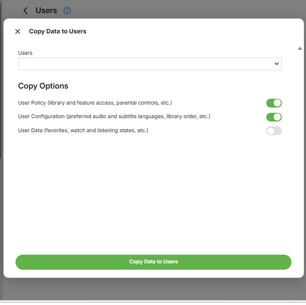
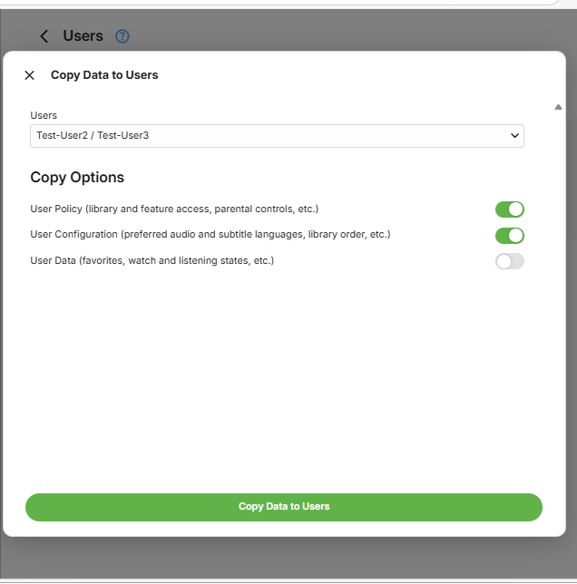
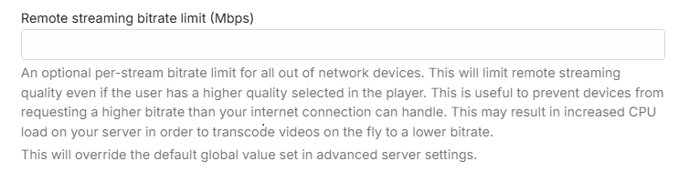
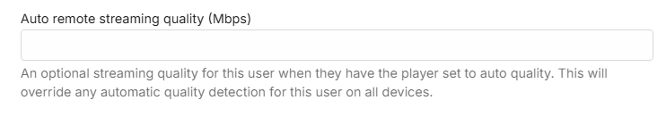

Users are managed within the server dashboard by navigating to **Users**.

Once a local user account has been created, the first step should be to set and save a password for that account. See [Passwords](Passwords.md).

You can link the local user account to an Emby Connect e-mail address. See [Emby Connect](Emby-Connect.md).

You can control remote connections to the server at the user level.

You can disable or hide a user, as well as lock them from changing their user profile settings.

Disabling a user will do just that. All existing sessions from that user will be abruptly terminated.

Hiding a user will simply remove them from visual login screens. They will need to enter their username and password manually.

Disabling user option to change their password and profile image would just do that. It would also not show the user the optional setting or changing of a profile pin. This is useful for administrators who prefer to dictate these terms to their users.

## Copying user preferences and settings from one user to other users

As from Emby Server version 4.10.x and following the release of advanced Home Page customization options, a feature was added to allow you to replicate the customization from one user account to one or more other user accounts.

In this example below, we are to copy the settings from **Test-User1** to **Test-User2** and **Test-User3**.

Select **Users** from the server dashboard and then locate the user to copy the data from and click on the **...**

You will see an option to copy data in the pop-up box

Clicking on **Copy Data to Users** will show the **Copy Options** available and a drop-down for the Users to select as target to copy to. **Take extra care when selecting users to copy the settings to.**

In this example, I have ticked **Test-User2** and **Test-User3** as the target users to copy **Test-User1** settings and preferences to.

## Feature Access

Features can be granted or denied, such as the ability to delete media, download media, view live tv, manage live tv, etc. The "Allow media playback" option determines if the user is able to play media or not. This option is handy if you'd like to setup a user who can browse the library but not play anything.

You can set a limit on the number of concurrent video streaming sessions for the user. Note that this requires [Emby Premiere](Emby-Premiere.md) for it to be enforced. 

You can also limit the bandwidth per video streaming for devices away from the local network.

And in cases where the remote device has quality set to Auto, you can also put a bandwidth limit to override that.

If you want to allow media deletions by the user, you can select from the list of libraries and channels.

You can also decide how they can remote control shared devices. Remote controlling another user allows them to send content to devices for playback while another user is signed in. Remote controlling shared devices, such as Dlna devices, allows them to send content to those as well. These can be set now or later.

Other features can also be configured: Downloads, Subtitles, Camera Upload, Media Conversion, Sharing playlists and some limited media information sharing on social media.

## User Profile and Preferences

See [User Preferences](User-Prefs.md).

## Content Access

See [Content Access](Content-Access.md).

## Device Access

See [Device Access](Device-Access.md).

## Parental Controls

See [Parental Controls](Parental-Controls.md).

## User Password

See [Passwords](Passwords.md).
