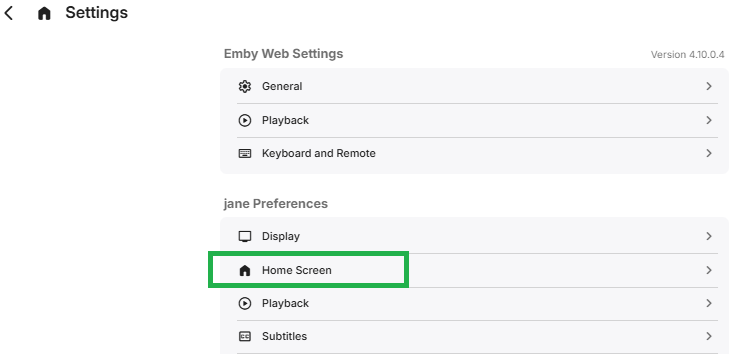
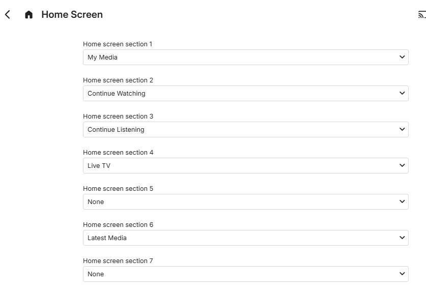
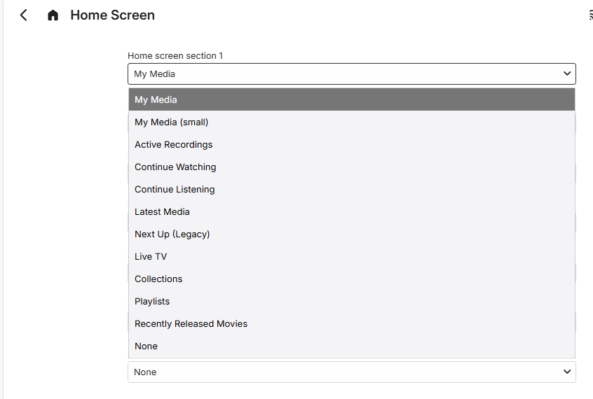
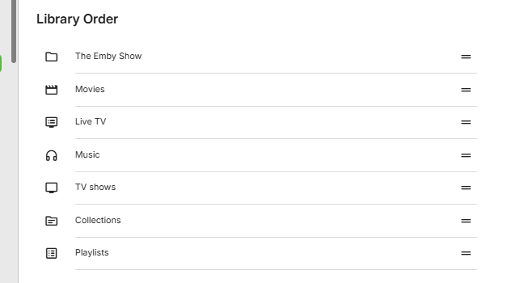
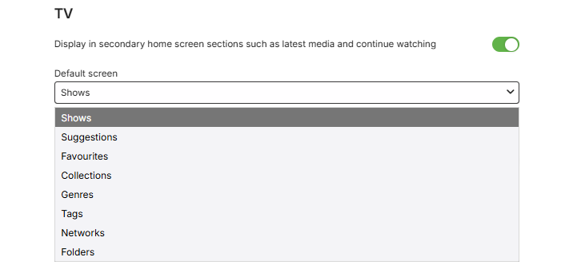

Emby Server Admin can setup and edit the users Home Page through the the server dashboard by navigating to **Users**, selecting the user and then clicking the link **"Edit this user's profile, image and personal preferences"** which appears below the **Profile** tab.

The users, themselves can setup and edit the Home Screen by navigating to **App Settings** and clicking on "Home Screen" within the user **Preferences**.

## Emby Server versions 4.8.x and 4.9.x

Up to 7 section types can be configured for the user's Home Screen, with the default being:

For each section, a drop-down is available to choose from:

This is followed by a list of the libraries to show the **Library Order**. Library positions can be changed by moving the rows around.

Below the library order list, each library is shown with a configurable option for inclusion in sections like **Latest Media** and **Continue Watching** and also an option for the default screen to be pre-selected when viewing the library. The following is an example of this for a TV Shows library, named **TV**:

