Emby Server Admin can setup and edit the users Home Page configuration through the the server dashboard by navigating to **Users**, selecting the user and then clicking the link **"Edit this user's profile, image and personal preferences"** which appears below the **Profile** tab.

The users, themselves can setup and edit the Home Screen selections by navigating to **App Settings** and clicking on "Home Screen" within the user **Preferences**.

> [!TIP]
> Server admin can replicate the Home Screen customization from one user account to other user accounts. Have a look at this in [User Customization](User-Customization.md) once you have a configuration for one user account that you want to replicate.

There are very advanced and functionality rich options for customizing the users Home Screens introduced in Emby Server 4.10.x, giving you the ability to:

- Limiting certain sections to specific libraries
- Choosing the image that is used (poster/thumb)
- Overriding the scroll direction
- Recently released episodes
- Creating a home screen section based on a playlist, collection, genre or tag.
- Dynamic views based on extensive selection criteria with added option for Spotlight view

The following shows the default initial **Home Screen** contents and preferences. In this example, **Emby Show** plugin is installed and there is one library for each of Movies, TV Shows and Music and LiveTV is setup.

## Default Home Screen Sections

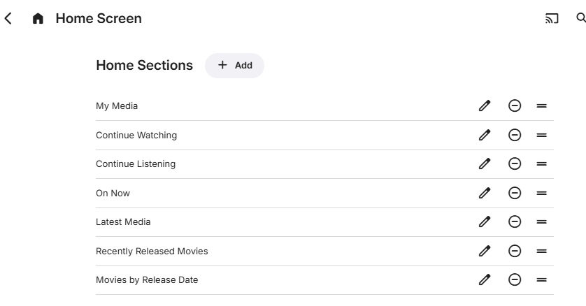

The order in which the libraries are shown is determined by the **Library Order** list that follows. Each library is listed and can be re-ordered by selecting the row and moving it up or down. Rows are also shown for LiveTV, Collections, Playlists and installed additions such as The Emby Show.

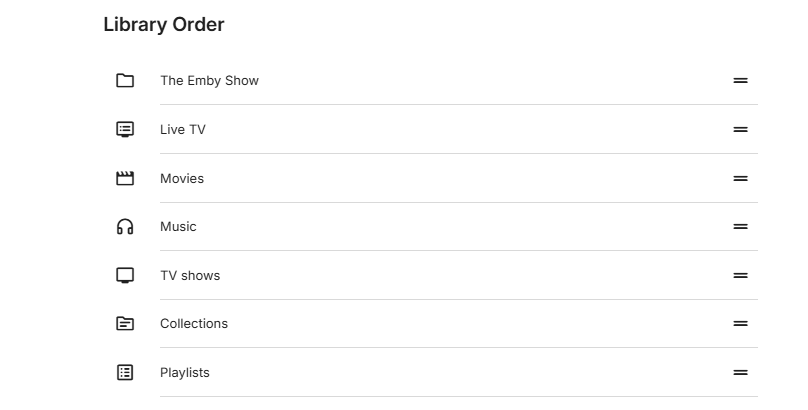

Below this, there are options for selecting the default screens for each.

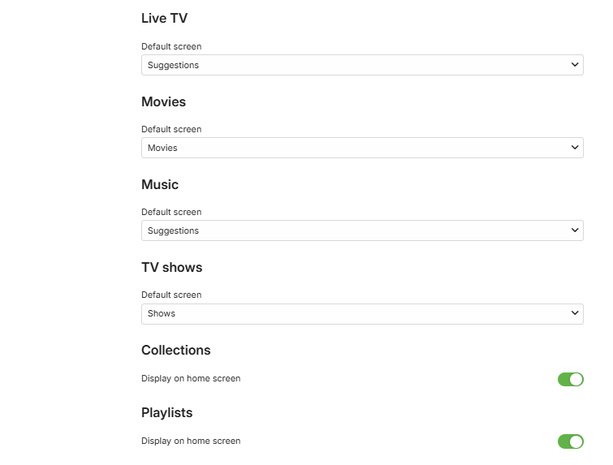

## Adding and customizing Home Screen sections

There is no limit on the number of sections to be added to the Home Screen. A section type can be added more than once with different selection and presentation options. The order the sections appear can be changed by selecting a row within the "**Home Sections**" settings page and dragging up or down. The following shows the various section types that can be added:

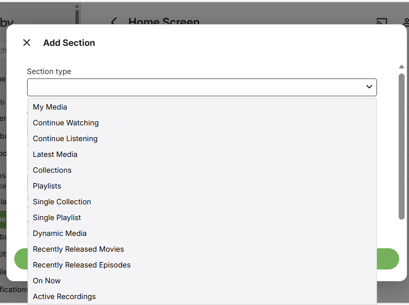

Some of the options that were available for Home Screen customization in previous versions of Emby Server, have now been moved and covered by the configuration options available when adding or editing a section.

For example, the old "**Next Up (Legacy)**" is no longer available as a section type but the options for "**Continue Watching**" will include one for "**Include next up episodes**".

Also libraries home screen preferences for inclusion in secondary home screen sections such as **Latest Media** and **Continue Watching** have been removed and equivalent functionality is now provided by having a library list to tick for each section.

With the variety of available options, you will see now that there may be more than one way to achieve what you like to see on the Home Screen.

The following options and choices are common for most Home Screen section types:

**Custom Title**

You have the option to specify a custom title for the sections for all but sections for the "Latest Media" section type. If the option is available and left blank, the title will be automatically generated.

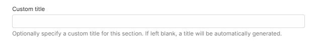

**View Type**

Most section types that have this option, will give a choice of **Cards** or **Buttons**. 

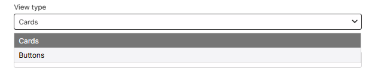

Some section types will offer **Spotlight** or **Cards** views, these being for **Dynamic Media** and **Recently Released Movies** section types.   

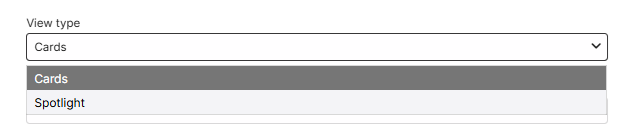

**Libraries**

A drop-down list of all libraries will be shown where you can exclude/include individual libraries. This list will also include components such as Live TV, Web Streams and IPTV. Example:

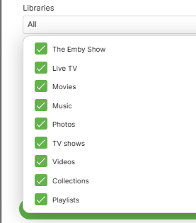

**Sort By** and **Sort Order**

Extensive list of sort options are provided with Ascending or Descending sort order.

Example:

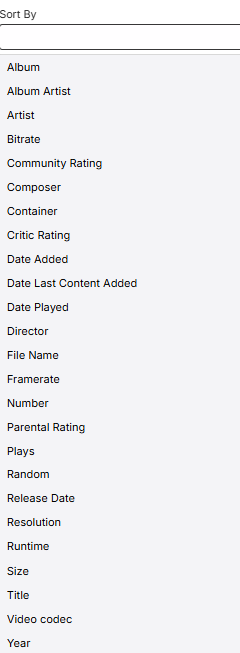

**Scroll Direction**

This will be a choice between **Auto** (the default) and **Horizontal** or **Vertical** to override apps scroll direction. When set to Auto, Emby apps will choose a scroll direction based on several factors such as screen size, orientation, form factor. 

> [!NOTE]
> Forcing vertical scroll direction may result in the number of items shown being limited for performance reasons.

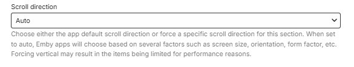

and options being:

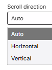

**Image Type**

This will be a choice between **Auto** (the default) and **Primary** or **Thumb** image.

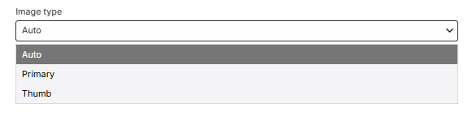

The following details each section type:

### **1. Section Type: My Media**

Select "**My Media**" as the Section type when adding a section. The following top level options are available:

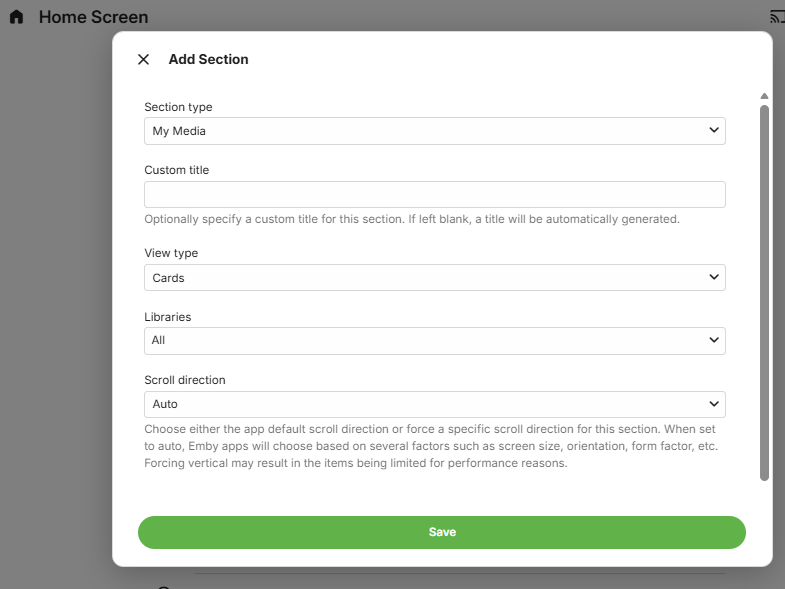

You can name the section as you like, using the **Custom title** field. 

Two view types are available: "**Cards**" or "**Buttons**".

Example of "**Cards**" view:

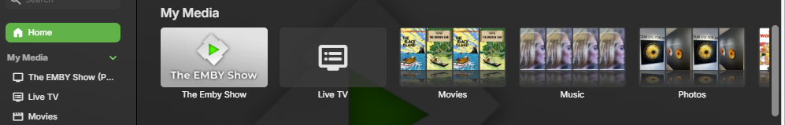

Example of "**Buttons**" view:

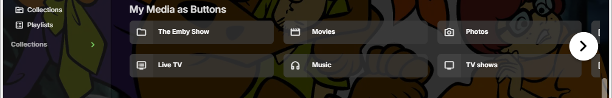

You can specify which libraries are to be included in this section. It is defaulted to all. Deselect what is not required for this section. 

You have an option to override the Emby client app default for scroll direction which would be used when "Auto" is selected. When set to Auto, Emby apps will choose a scroll direction based on several factors such as screen size, orientation, form factor. The choice is Auto, Horizontal or Vertical.

> [!NOTE]
> Forcing vertical scroll direction may result in the number of items shown being limited for performance reasons.

with scroll options being:

Click **Save** to create the Home Screen section or complete editing.

### **2. Section Type: Continue Watching**

Select "**Continue Watching**" as the Section type when adding a section.

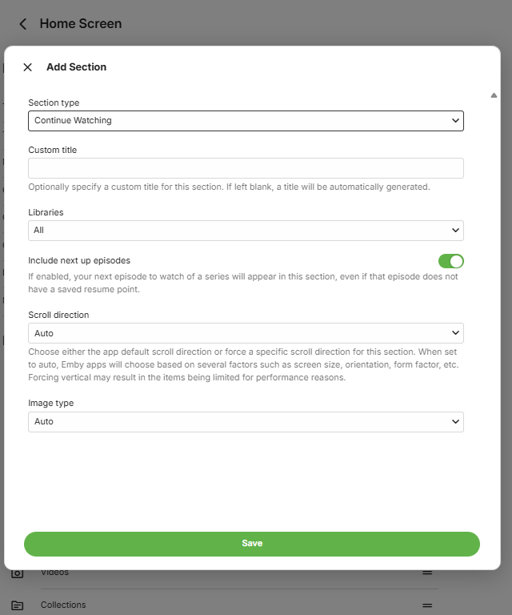

There are similar options to those described above for the "**My Media**" section type. with two additions:

A tick-box for creating a "**Next Up**" view to show the next episode to watch in a series:

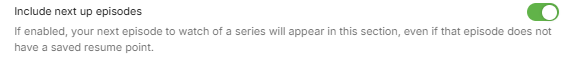

and an option for selecting the **Image type**:

### **3. Section Type: Continue Listening**

Select "**Continue Listening**" as the Section type when adding a section.

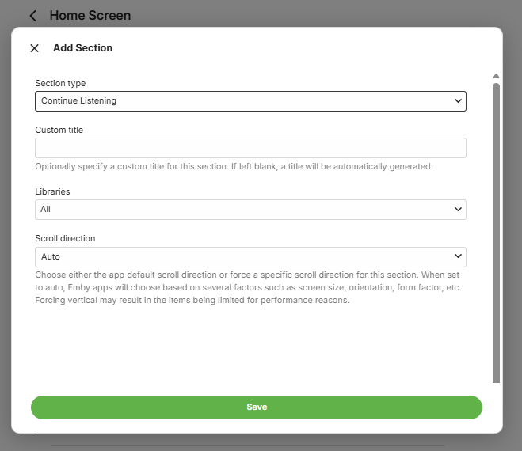

Options are available to give a custom name for the Home Screen section, to select the libraries and to specify the scroll direction. These are as described above.

### **4. Section Type: Latest Media**

Select "**Latest Media**" as the Section type when adding a section.

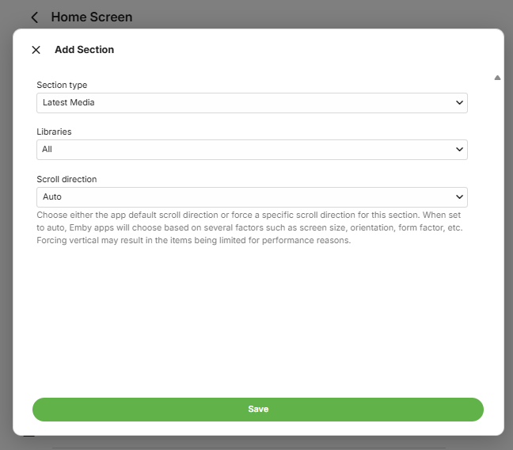

Libraries can be selected / excluded for this. A **"Latest library_name"** section would appear on the Home Screen for each selected library. The **Library Order** settings described earlier would determine the order. 

You have an option to override the Emby client app default for scroll direction which would be used when "Auto" is selected. When set to Auto, Emby apps will choose a scroll direction based on several factors such as screen size, orientation, form factor. The choice is Auto, Horizontal or Vertical.

> [!NOTE]
> Forcing vertical scroll direction may result in the number of items shown being limited for performance reasons.

The following is an example of **Latest Media** sections added to the Home Screen:

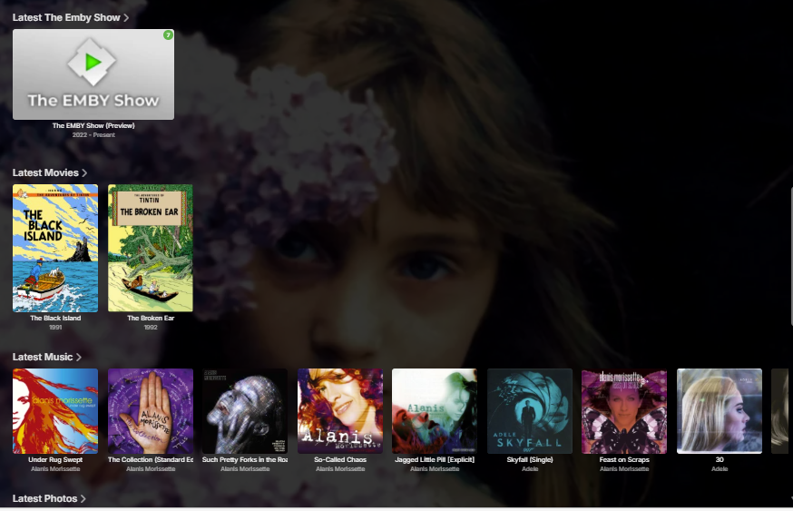

### **5. Section Type: Collections**

Select "**Collections**" as the Section type when adding a section.

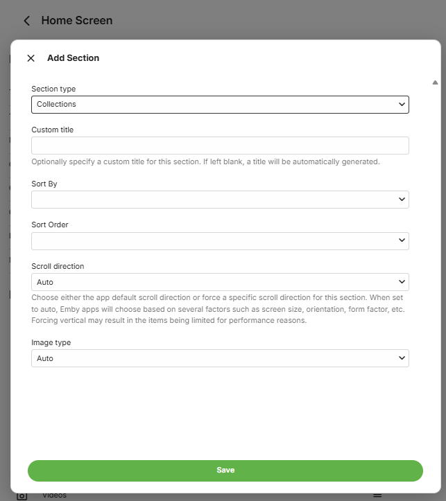

The title can be changed from the default by specifying your "Custom title".

Select the sort by criteria for section:

You have an option to override the Emby client app default for scroll direction which would be used when "Auto" is selected. When set to Auto, Emby apps will choose a scroll direction based on several factors such as screen size, orientation, form factor. The choice is Auto, Horizontal or Vertical.

> [!NOTE]
> Forcing vertical scroll direction may result in the number of items shown being limited for performance reasons.

And option for the image type:

### **6. Section Type: Playlists**

Select "**Playlists**" as the Section type when adding a section.

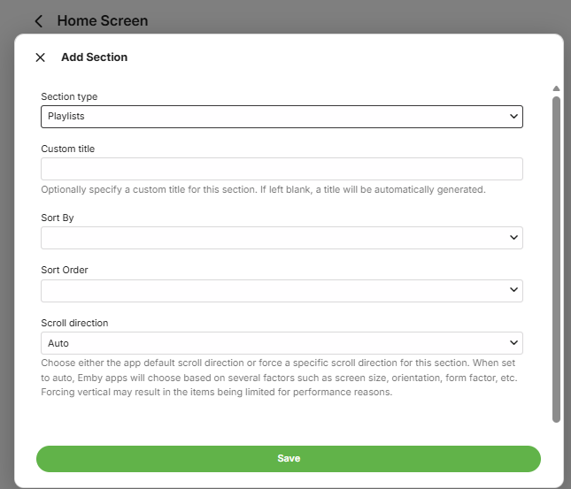

The title can be changed from the default by specifying your "Custom title".

Select the sort by criteria for section:

You have an option to override the Emby client app default for scroll direction which would be used when "Auto" is selected. When set to Auto, Emby apps will choose a scroll direction based on several factors such as screen size, orientation, form factor. The choice is Auto, Horizontal or Vertical.

> [!NOTE]
> Forcing vertical scroll direction may result in the number of items shown being limited for performance reasons.

### **7. Section Type: Single Collection**

Select "**Single Collection**" as the Section type when adding a section.

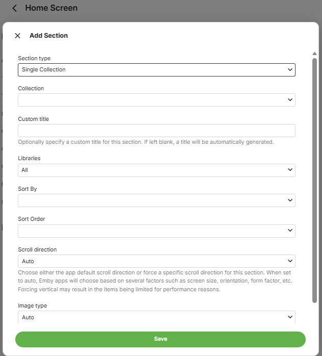

Open the Collection drop-down and choose the collection, e.g.

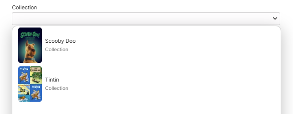

The title can be changed from the default by specifying your "Custom title".

Select the sort criteria

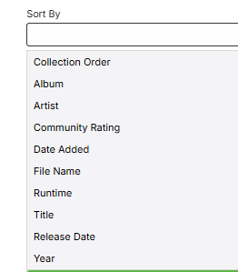

You have an option to override the Emby client app default for scroll direction which would be used when "Auto" is selected. When set to Auto, Emby apps will choose a scroll direction based on several factors such as screen size, orientation, form factor. The choice is Auto, Horizontal or Vertical.

> [!NOTE]
> Forcing vertical scroll direction may result in the number of items shown being limited for performance reasons.

The following shows an example of a **Tintin** collection added as a section, with title for the section set to **The Tintin Collection**, sort using the **Collection Order** option. The first shows the automatic scroll option where the whole collection items can be seen by horizontally scrolling:

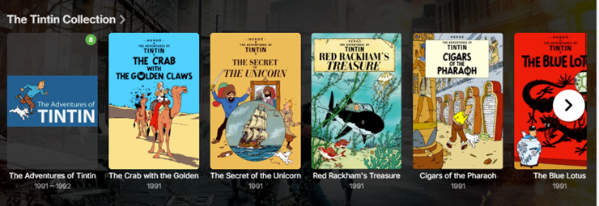

In the second example, the section had an override of vertical scroll direction. The collections items shown is limited to 16.

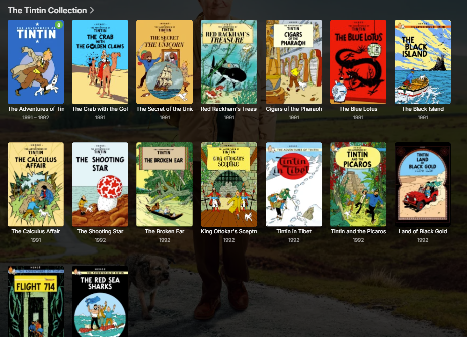

### **8. Section Type: Single Playlist**

Select "**Single Playlist**" as the Section type when adding a section.

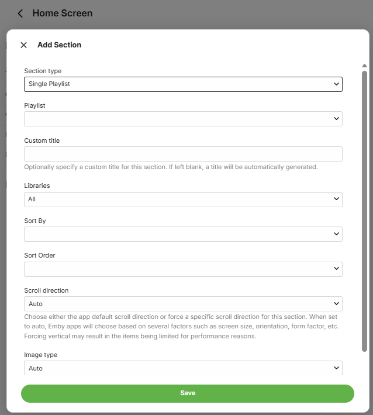

Open the Playlists drop-down and choose the playlist, e.g.

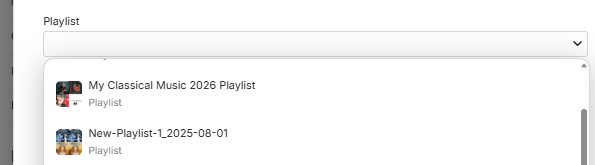

The title can be changed from the default by specifying your "Custom title".

Select the sort criteria

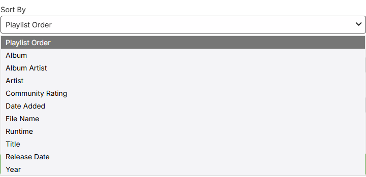

You have an option to override the Emby client app default for scroll direction which would be used when "Auto" is selected. When set to Auto, Emby apps will choose a scroll direction based on several factors such as screen size, orientation, form factor. The choice is Auto, Horizontal or Vertical.

> [!NOTE]
> Forcing vertical scroll direction may result in the number of items shown being limited for performance reasons.

The following is example of a Single Playlist section for a music playlist. The first is with the auto scrolling option, resulting in horizontal scroll and all items in the playlist can be seen by scrolling:

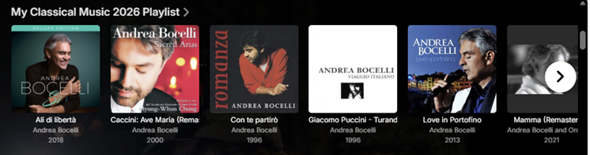

The second example is with vertical scrolling being set for the section, which results in the list of items being limited to 16.

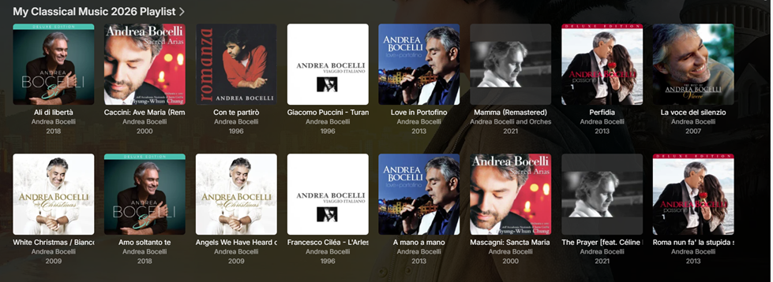

### **9. Section Type: Dynamic Media**

This section type allows you to create a dynamic section depending on specific media types and metadata and present it optionally as a Spotlight section.

Select "**Dynamic Media**" as the Section type when adding a section.

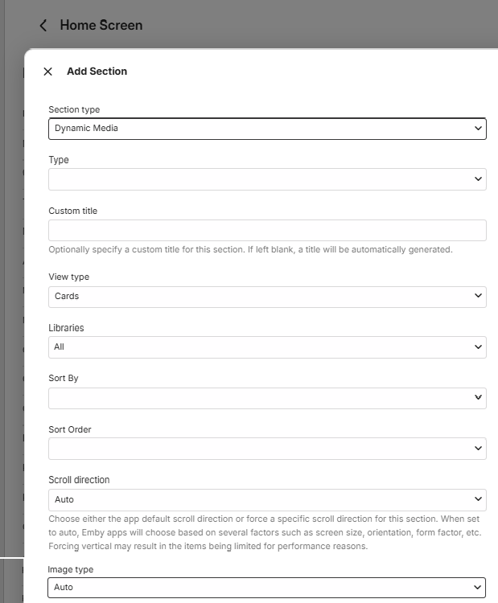

You have many different types to choose from:

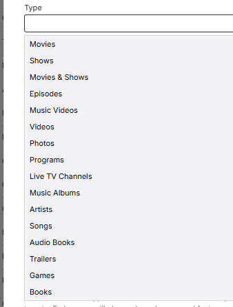

Make a selection.

Give the section a title by entering it in the "Custom title" field.

You now have a choice of creating a Spotlight view or a normal view section.

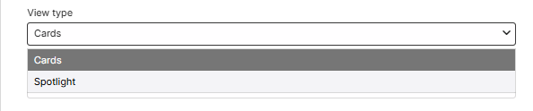

Select the libraries for this home screen section.

and choose a sort by option and an Ascending or Descending sort order.

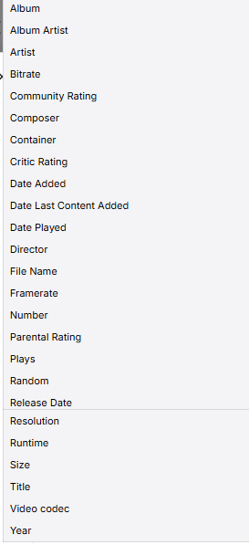

Scroll down to add the filter options for this section. 

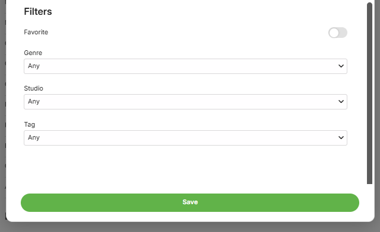

You can select Favorites, Genres, Studios and most important, Tags.

This is a Spotlight example of a dynamic view selected using a tag.

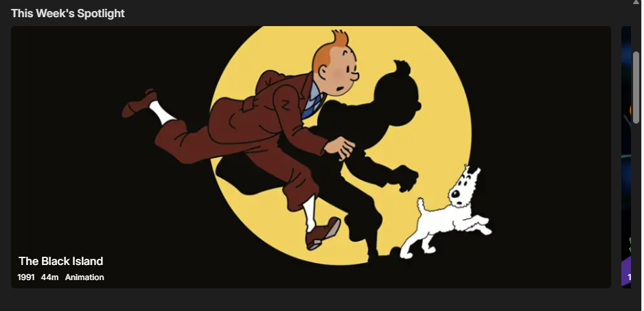

> [!NOTE]
> The section title is omitted for the spotlight section if displayed at the top.

The following shows the view using view type Cards instead of a Spotlight view:

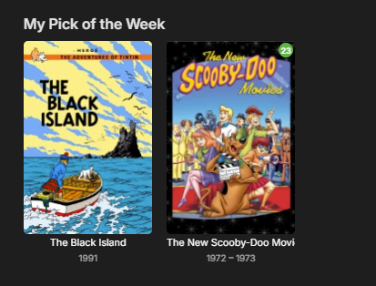

### **10. Section Type: Recently Released Movies**

Select "**Recently Released Movies**" as the Section type when adding a section.

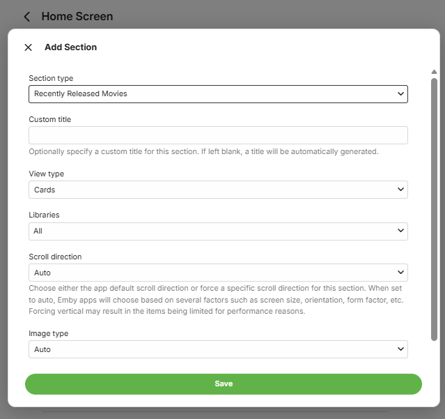

Give the section a title by entering it in the "Custom title" field.

You have a choice of creating a **Spotlight** view or a normal **Cards** view section.

Select the libraries for this home screen section.

You have an option to override the Emby client app default for scroll direction which would be used when "Auto" is selected. When set to Auto, Emby apps will choose a scroll direction based on several factors such as screen size, orientation, form factor. The choice is Auto, Horizontal or Vertical.

> [!NOTE]
> Forcing vertical scroll direction may result in the number of items shown being limited for performance reasons.

And option for the image type for the **Cards** view type:

The following shows example of a default image type Cards view type

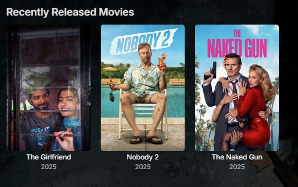

And the same section with **Thumb** Image Type

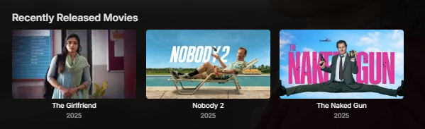

The same section with a Spotlight view type, with each movie showing like this

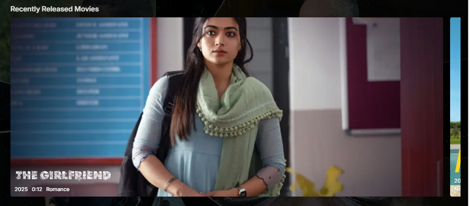

and

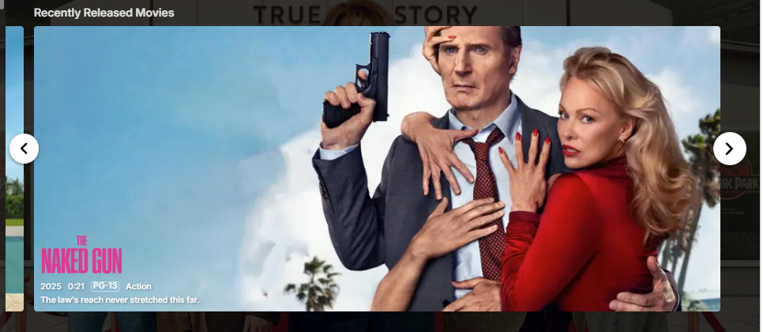

### **11. Section Type: Recently Released Episodes**

Select "**Recently Released Episodes**" as the Section type when adding a section.

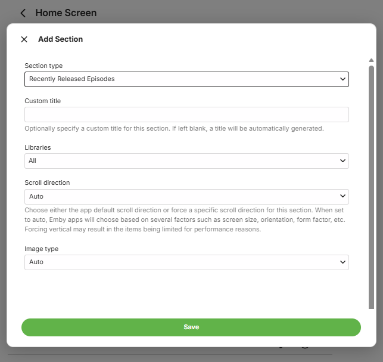

Give the section a title by entering it in the "Custom title" field.

Select the libraries for this home screen section.

You have an option to override the Emby client app default for scroll direction which would be used when "Auto" is selected. When set to Auto, Emby apps will choose a scroll direction based on several factors such as screen size, orientation, form factor. The choice is Auto, Horizontal or Vertical.

> [!NOTE]
> Forcing vertical scroll direction may result in the number of items shown being limited for performance reasons.

And option for the image type 

The following is an example using default options

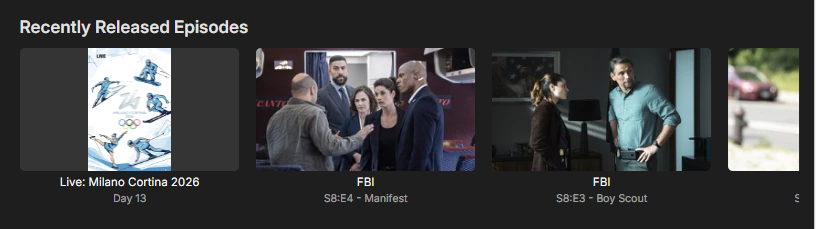

### **12. Section Type: On Now**

Select "**On Now**" as the Section type when adding a section.

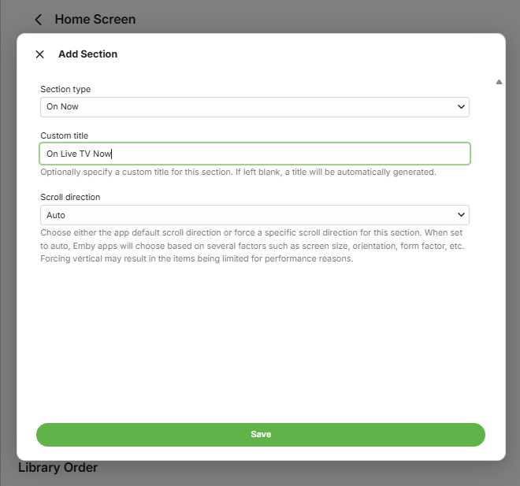

Give the section a title by entering it in the "Custom title" field.

You have an option to override the Emby client app default for scroll direction which would be used when "Auto" is selected. When set to Auto, Emby apps will choose a scroll direction based on several factors such as screen size, orientation, form factor. The choice is Auto, Horizontal or Vertical.

> [!NOTE]
> Forcing vertical scroll direction may result in the number of items shown being limited for performance reasons.

Example on the Home Screen

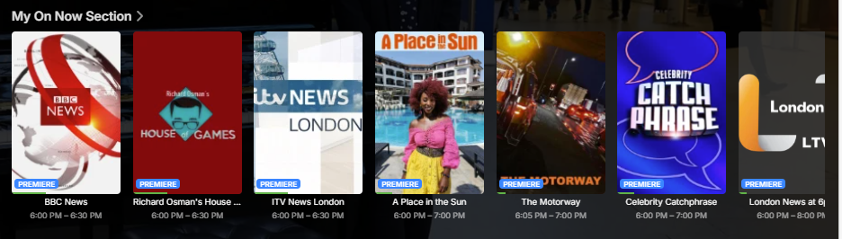

### **13. Section Type: Active Recordings**

Select "**Active Recordings**" as the Section type when adding a section.

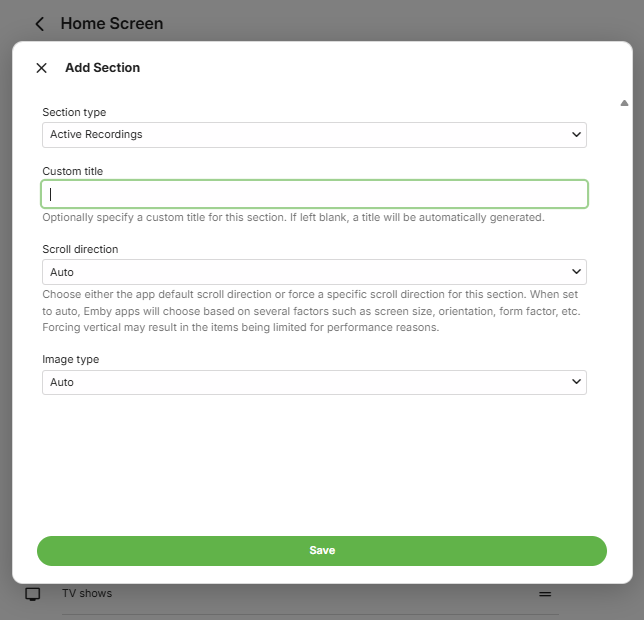
