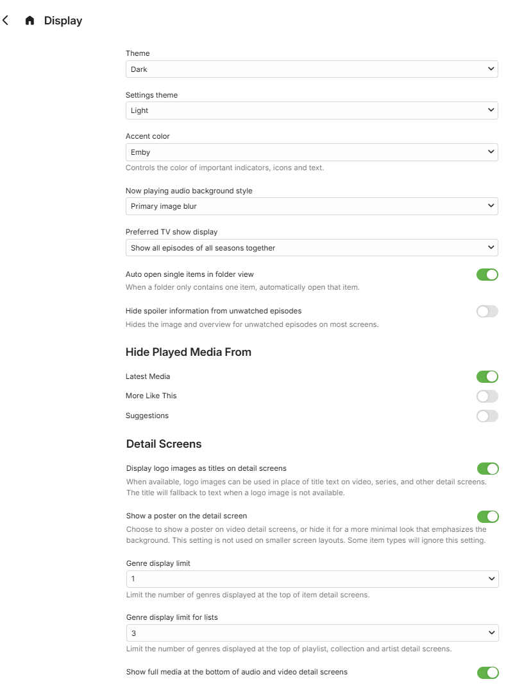
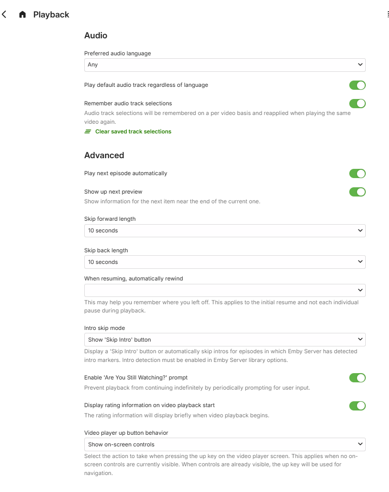
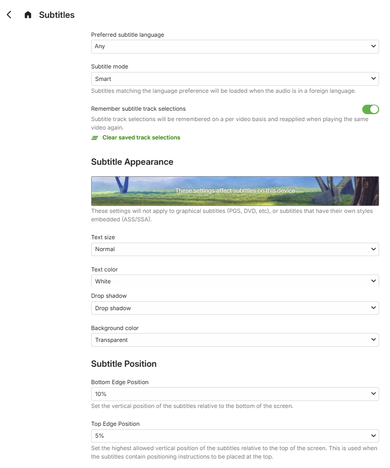
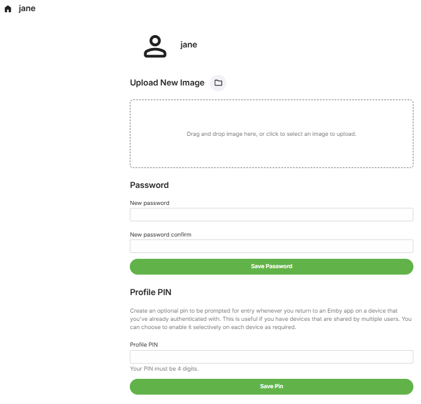
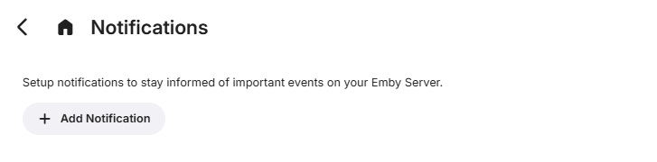

Users are managed within the server dashboard by navigating to **Users**.

## User Profile and Preferences

Select the user and click the link **"Edit this user's profile, image and personal preferences"** which appears below the **Profile** tab.

The link takes you to the following screen which is the same screen that the user gets on selecting **App Settings** except for the **Profile** section which would not show if the user is not allowed to change password or image.

### User Preferences

### **Display**

### **Home Screen**

Please see [User Home Screen Customization](User-HomeScreen.md). 

For earlier versions of Emby Server (4.8.x and 4.9.x), refer to [User Home Screen Customization (Legacy)](User-HomeScreen-Legacy.md).

### **Playback**

### **Subtitles**

### **Profile**

Clicking on the **Profile** button would allow the server administrator or the specific user to upload of a profile image and change the password and optional pin. Users that have this locked down by the server administrator would not see this option in the user preferences.

### **Notifications**

For detailed information on setting up notifications, see [Notifications](Notifications.md)
